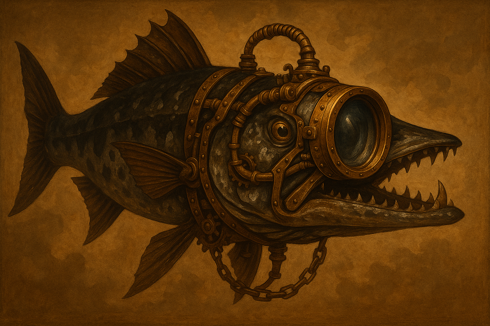

# namebreak-bombe

[Client for volunteers](https://github.com/sjoblomj/namebreak-bombe/releases) |
[Dashboard for community progress](https://namebreak-coordinator.fly.dev/)

A GPU-accelerated MPQ filename brute-forcer, plus the tooling around running
it at scale. MPQ archives (used by Blizzard games like StarCraft, Diablo, and
Warcraft III) index their files by a pair of 32-bit hashes of the filename
rather than storing filenames directly, so recovering an unknown filename
means finding a candidate string that hashes to both target values - that's
what the programs here do, by trying every combination of characters in a
given alphabet.

A progress dashboard for distibuted searching is available
[here](https://namebreak-coordinator.fly.dev/).

## What is namebreaking?

Blizzard's classic games keep their files in MPQ archives, which don't store
file names. Each file is found by hashes of its name instead: one hash picks
its slot in the archive's hash table, and two more 32-bit hashes, *Hash A* and
*Hash B*, confirm that the slot holds the right file. Hashes only work one way,
so a name can't be read back out of them. Some names can be caught by watching
which files a game opens, but archives are full of files the game never opens
at all, but that might still be of interest to understand how the games were
developed.

Later archives ship a list of their own file names, the `(listfile)` -
complete in Diablo II and Warcraft III, but missing or covering only a small
part of the files in Diablo, StarCraft, Brood War and Warcraft II Battle.net
Edition. For those, the only way to get a name back is to guess it: generate
candidate names, hash each one, and compare against the stored *Hash A* and
*Hash B*. That's namebreaking.

Guessing blind is tough, but the archives give plenty of clues. Files were
usually packed in batches, so neighbours in an archive tend to share a
directory and a file type; a file's decrypted contents give away its type, and
so its extension; and many names come in numbered series or share a leading
part. That can sometimes pin down everything but a few characters in the
middle - a directory like `REZ\` and an extension like `.WAV` are known, and
only the part in between is searched.

That's what the [coordinator](coordinator/README.md) is for. It splits each
*target*, one unknown name, into ranges of candidates and hands them out to
volunteers running the `namebreak` [client](client/README.md) on their GPUs.
The coordinator's dashboard shows how far each target has come, who searched
what, and the name, once it's found.

For more background, see Ladislav Zezula's
[writeup on name breaking](http://zezula.net/en/mpq/namebreak.html).

## Layout

- [`client/`](client/README.md) - the actively maintained client. Generates
  every candidate in a configured alphabet and length range and hashes each
  one on the GPU (CUDA, HIP, OpenCL or Metal) or the CPU. Runs standalone
  (`bounded`/`continuous` mode) against a fixed range, or as a worker for the
  coordinator below (`coordinator` mode).
- [`coordinator/`](coordinator/README.md) - a server for distributing a
  search across multiple volunteers' GPUs. Tracks targets, carves each one's
  candidate space into time-boxed ranges, and hands them out to
  `client` clients over HTTP, with a live dashboard showing
  progress and who found what.

## Getting started

Most work happens in [`client/`](client/README.md) (see
its README for configuring and compiling the client) and, for a distributed
search across multiple machines, [`coordinator/`](coordinator/README.md)
(see its README for running the server and pointing clients at it).

## Name

It is named after the [Bombe](https://en.wikipedia.org/wiki/Bombe), a British
WWII machine for breaking German
[Enigma](https://en.wikipedia.org/wiki/Enigma_machine) ciphers.
