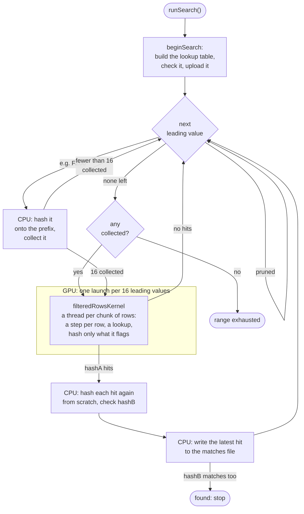
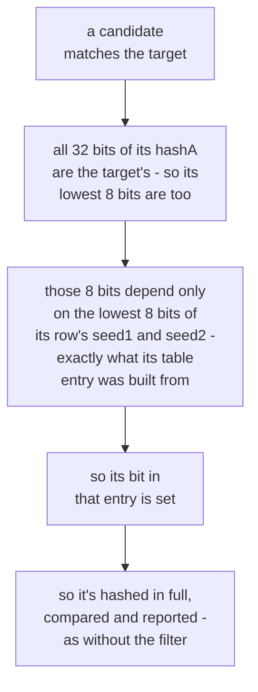
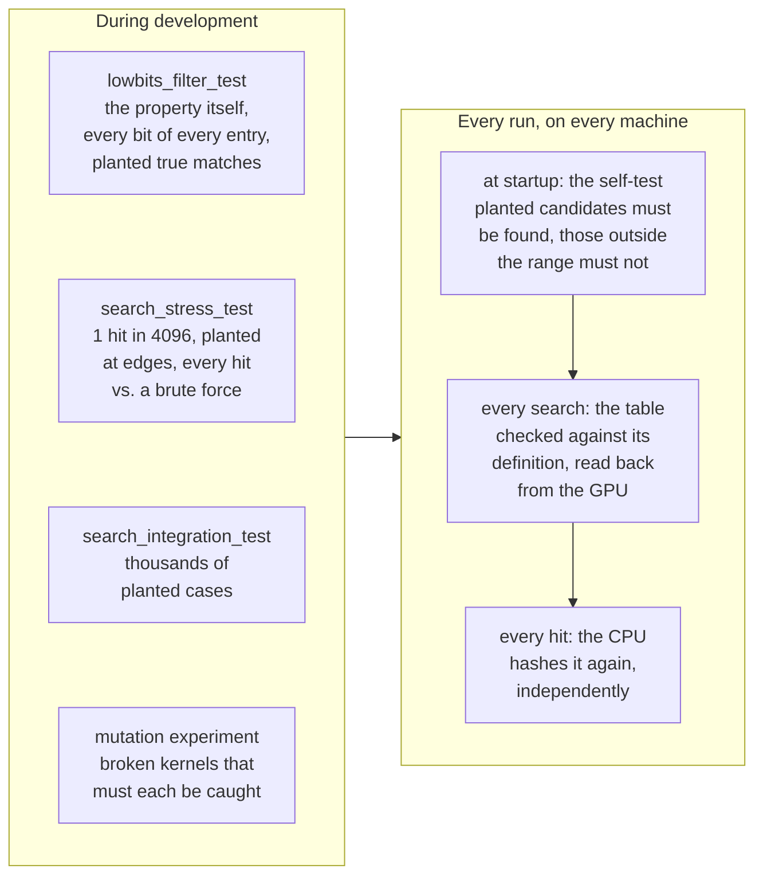

# namebreak-bombe

[Client for volunteers](https://github.com/sjoblomj/namebreak-bombe/releases) |
[Dashboard for community progress](https://namebreak-coordinator.fly.dev/)

A GPU-accelerated MPQ filename brute-forcer. MPQ archives (used by Blizzard
games like StarCraft, Diablo, and Warcraft III) index their files by a pair
of 32-bit hashes of the filename rather than storing filenames directly, so
recovering an unknown filename means finding a candidate string that hashes
to both target values. `namebreak` does that by generating every candidate
in a given alphabet and length range and hashing each one on the GPU via
CUDA. For background on MPQ hashing and why this works at all, see
[zezula.net's writeup](http://zezula.net/en/mpq/namebreak.html).

Every filename `namebreak` searches has the shape **prefix + candidate +
suffix** - the prefix and suffix are fixed, known strings (e.g. `REZ\` and
`.WAV`), and the candidate is the unknown part being brute-forced.

## Modes

`namebreak` runs in one of four modes, set via `config.conf`'s `mode = ...`
(or overridden by passing `--mode <mode>`, e.g. `build/namebreak --mode bounded`).
A different config file can be used instead of `config.conf` via
`--config <file>`.

It searches on the first backend (see [Backends](#backends)) that can run
on the machine - normally the GPU. A top-level `backend = <name>` line in
`config.conf`, or `--backend <name>`, picks one instead; running with an
unknown name lists the ones the build has.

- **`bounded`** - exhaustively searches candidates of exactly
  `start_candidate`'s length (or `lower_bound`'s, without one), between
  `lower_bound` and `upper_bound`, then exits.
- **`continuous`** - same as `bounded`, but once a length is exhausted it
  moves on to the next candidate length and keeps going indefinitely (up to
  `MAX_CANDIDATE_LEN`, 16 characters).
- **`coordinator`** - registers with a central coordinator server, claims a
  range of a shared target's search space, searches it, and reports back;
  repeats until stopped. A target is searched by alphabet, as `bounded` mode
  searches, or by words, as `dictionary` mode does (see [Dictionary targets
  in coordinator mode](#dictionary-targets-in-coordinator-mode)). See
  [`../coordinator/README.md`](../coordinator/README.md) for the server side
  and how this mode is configured.
- **`dictionary`** - searches candidates made of words: one word, or several
  with separators between them, from a dictionary compiled into the program
  (`english-1`) and word lists of your own - and, given the file's
  encryption key, records every candidate whose basename matches it. See
  [Dictionary mode](#dictionary-mode).

Exit code is `0` if both hashes matched, `2` if the search space was
exhausted without a match, `1` on any setup/config error.

## Version and updates

`namebreak -v` (or `--version`) prints which release this is - the GitHub
release tag it was built for, like `v2026-09-26`, or `dev` for a build that
isn't a release (see `NAMEBREAK_VERSION` under [Compiling](#compiling)).

At startup, a release build looks up the latest release on
[GitHub](https://github.com/sjoblomj/namebreak-bombe/releases) and, if
there's a newer one, says so and where to get it. It never downloads
anything, and says nothing if the lookup fails. A top-level
`check_for_updates = false` line in `config.conf` turns this off. A build
without networking (`NAMEBREAK_NETWORK=OFF`) never looks.

In `coordinator` mode, the server can refuse a release it considers too old.
namebreak then shows the server's message, saying what to get, and quits.

## Pausing

Press `p` (or `P`) at any point while `namebreak` is running interactively
to pause the search - the same key cgminer/xmrig and other long-running GPU
compute tools use for this. The GPU batch already in flight always finishes
normally; no new one starts until `p` is pressed again to resume. Ctrl+C
pauses too, on the first press - a reflexive Ctrl+C doesn't lose the run
outright, since a pause is trivially undone. A second Ctrl+C, while already
paused by either method, actually quits. In `coordinator` mode,
heartbeating keeps going while paused (it runs on its own thread,
independent of the search itself), so a paused client doesn't lose its
claimed range to a lease timeout - it just makes no progress on it until
resumed. No new range is claimed while paused.

Also in `coordinator` mode, `f` (or `F`) means "finish the current range,
then pause": the client carries on with the range in hand, reports it
complete, and pauses before claiming new work. Pressed while paused, it
resumes the search for the rest of that range; pressed while running, it
just arranges the pause. `p` still pauses and resumes in the meantime
without cancelling it, and pressing `f` again cancels it, so the client
carries on claiming new work as usual. With no range in hand (paused
between ranges, or waiting for work), it pauses right away. The Windows GUI
has the same option as a "Finish current range, then pause" checkbox, and
in its tray menu.

Keys are only available when stdin is an actual interactive terminal
(not when redirected/piped, or with no controlling terminal at all, e.g. a
cron job or systemd service) - `namebreak` prints `Press 'p' to
pause/resume the search.` on startup when it is.

## Configuring

`namebreak` reads `config.conf` from the current working directory, or the
file given with `--config <file>`, every time it starts; without one it
stops and says what the smallest working one looks like (the Windows GUI
runs its setup dialog instead, and writes one). It's a flat `key = value`
file with up to three `[section]` blocks; `#`-led lines and blank lines are
ignored, and a value only needs `"..."` quoting if it has meaningful
leading/trailing whitespace (a literal `\` needs no escaping).

```ini
mode = continuous

[search]
alphabet = " !&'()+,-.0123456789ABCDEFGHIJKLMNOPQRSTUVWXYZ[]_"
max_backslash_count = 0
prefix = REZ\
suffix = .WAV
lower_bound = REZ\FINZ09BX.TXT
upper_bound = REZ\GAMEMENU.BIN
hash_a = 0xF60F5D90
hash_b = 0xCE0A9BDB
prune_symbol_runs = true
prune_unopened_brackets = true
resume_from_last_candidate = true
```

`[search]` keys (used by both `bounded` and `continuous` mode):

| Key | Required | Meaning |
|---|---|---|
| `alphabet` | yes | Every character a candidate may contain: any number of them from 1 to `MAX_ALPHABET_SIZE` (63). |
| `max_backslash_count` | yes | Max `\` occurrences allowed in a candidate before it's skipped; `0` means unlimited. To forbid `\` entirely, leave it out of `alphabet` instead - `0` is "no limit", not "zero allowed". |
| `prefix` / `suffix` | yes | The fixed parts of the filename around the candidate. |
| `start_candidate` | no | Full filename (prefix+candidate+suffix) to begin searching from. Without it, the search starts from the beginning: in `continuous` mode the shortest candidates (as if it were just prefix+suffix - that filename itself isn't checked), in `bounded` mode, which searches only one candidate length, `lower_bound`. |
| `resume_from_last_candidate` | no (default `false`) | Resume from the last line of the matches file (see below), the most recent Hash-A match - so a stopped search can simply be restarted to carry on from about where it was. If there's also a `start_candidate`, it starts from whichever of the two the search reaches later (longer candidates come after shorter ones). A last line that doesn't belong to this search - another prefix or suffix, or characters outside `alphabet`, since `bounded`/`continuous` searches share one matches file - is ignored, with a note. Either way, the search prints the candidate it starts from. |
| `lower_bound` / `upper_bound` | yes | Full filenames (inclusive) bounding the search alphabetically, at every candidate length searched. |
| `hash_a` / `hash_b` | yes | The two target MPQ hashes, hex (`0x` prefix optional). |
| `prune_symbol_runs` | no (default `false`) | Skip candidates containing 3+ consecutive non-alphanumeric, non-space characters (real MPQ filenames essentially never have runs like that) - see [Design decisions](#design-decisions). |
| `prune_unopened_brackets` | no (default `false`) | Skip candidates that close a bracket never opened: reading left to right, a `)` at a point where more `)` than `(` have been seen, or likewise a `]` with `[`. The two kinds are counted separately (how they nest within each other isn't checked). Brackets left open by `prefix` count as opened, so a candidate may close those - see [Design decisions](#design-decisions). |
| `min_backslash_count` | no (default `0`) | Min `\` occurrences a candidate must have; `0` means none needed. Like `max_backslash_count`, the prefix's own don't count, and it must not be more than `max_backslash_count` (unless that's `0`). A candidate is skipped once the characters checked (see `prune_whole_candidate`) leave too few after them to make up the difference, even if every one were a `\` (every other one, with `prune_adjacent_backslashes`) - so without `prune_whole_candidate`, only candidates that need more `\` than the last five or so characters can hold. |
| `prune_adjacent_backslashes` | no (default `false`) | Skip candidates with two `\` next to each other - including a `\` at the very start of the candidate when `prefix` ends with one. |
| `insert_from_start` / `insert_from_end` | no | Text inserted into every candidate, as `text, position` (e.g. `\, 3`; quote the text if it has leading or trailing spaces, `" A ", 3`; at most 16 characters): after the candidate's first `position` characters, or before its last `position`. A candidate shorter than the position gets nothing inserted; both are placed on the candidate's own characters, and where they meet `insert_from_start` comes first. `lower_bound`, `upper_bound` and the length a search covers are without them; the filenames it reports, `start_candidate` and the matches file it resumes from are with them. The pruning rules check inserted text like the candidate's own characters, except text inserted after its last character, which is part of the suffix. See [Inserted text](#inserted-text) for what it costs. |
| `prune_whole_candidate` | no (default `false`) | Apply `prune_symbol_runs`, `prune_unopened_brackets`, `max_backslash_count`, `min_backslash_count` and `prune_adjacent_backslashes` to every character of a candidate but the last, instead of only to its leading characters (all but the last five or so). About a fifth fewer candidates are searched, and a search is about 10% faster on a GPU - see [Design decisions](#design-decisions). |
| `matches_name` | no | Names the matches file: `matches-<matches_name>.txt` instead of `matches.txt`, so that searches for different files don't share one. Characters other than letters, digits, `.`, `-` and `_` become `_`. |

`[coordinator]` keys (`coordinator` mode only) are `server_url` (required),
plus optional `username`, `hostname` (auto-detected and interactively
confirmed if omitted), and `poll_interval_secs` (default `30`) - see the
coordinator README linked above for the full picture.

The most recent Hash-A match (a candidate matching the first hash, whether
or not it matches the second) is kept in a matches file: one filename on one
line, replaced as the search goes - at most once a second - so the file stays
a few dozen bytes however long the search runs. A match of both hashes is
always the line it ends with: the search stops there. It's also appended to
`found.txt` beside the matches files, which gets nothing else and is never
replaced, so a later search writing the same matches file can't lose it.
They all go in one directory -
`matches/` in the current directory, or whatever a top-level
`matches_dir = <directory>` line (next to `mode`) says; it's created if
missing. `bounded`/`continuous` mode writes `matches.txt` there (or
`matches-<matches_name>.txt`), `dictionary` mode the same and two more files
(see [Dictionary mode](#dictionary-mode)), and `coordinator` mode one
`matches-<target name>.txt` per target - and, for a dictionary target, the
basenames not sent yet and the word lists it downloaded (see [Dictionary
targets in coordinator mode](#dictionary-targets-in-coordinator-mode)).

## Dictionary mode

Instead of every string of an alphabet, `mode = dictionary` searches
candidates made of words: one word, or several with a separator between each
two, every word from the same list and every separator from the same list.
With the words `CRDT` and `LST` and the separators `""` and `_`, the
two-word candidates include `CRDTLST`, `CRDT_LST` and `LST_CRDT`. A
filename is still prefix + candidate + suffix.

For example, the basename of a credits file whose directory isn't known -
no prefix, so only the basename can match, by its encryption key:

```ini
mode = dictionary

[dictionary]
dictionaries = lists/starcraft-words.txt
max_words = 2
separators = "", "_", "-", " "
prefix = ""
suffix = .txt
hash_a = 0xC4F43358
hash_b = 0x7694C48D
encryption_key = 0x4565C467
matches_name = sc-ptbr-credits
resume_from_last_candidate = true
```

`[dictionary]` keys:

| Key | Required | Meaning |
|---|---|---|
| `builtin_dictionary` | no (default `english-1`) | The dictionary compiled into the program, or `none` to search only `dictionaries`. `english-1` is 63,875 English words - see below. |
| `dictionaries` | no | More word lists, as a list of files (relative to the current directory, unless absolute): one word per line. Spaces and tabs around a word are dropped; blank lines and lines starting with `#` are skipped; a line with anything but printable ASCII is skipped, with a warning. The words of every list and the built-in dictionary are searched together, each once. |
| `min_words` / `max_words` | `max_words` yes (`min_words` default `1`) | How many words a candidate has: every count from `min_words` to `max_words` (at most 8), fewest first. |
| `separators` | no (default `""`) | What goes between two words, as a list: `""` writes them together. `"\"` makes the words before it directories. |
| `prefix` / `suffix` | yes | The fixed parts of the filename around the candidate. |
| `lower_bound` / `upper_bound` | no | Whole filenames (inclusive) bounding the search alphabetically - typically an unknown file's neighbours in the archive. Either may be left out. |
| `hash_a` / `hash_b` | yes | The two target MPQ hashes, hex. |
| `encryption_key` | no | The file's raw encryption key, hex: hash type 3 of its basename, before the adjustment for its position and size in the archive (mpqcli's `encryption-key-raw`, the coordinator's `encryption_key_hex`). Every candidate whose basename - what follows the filename's last `\` - hashes to it is recorded (see `record_basenames`), and, unless the suffix has a `\`, only those candidates are compared to `hash_a` and `hash_b` at all: the file's name has that basename, so no other can be it. That makes the search about a third faster (see [Dictionary searches on the GPU](#dictionary-searches-on-the-gpu)) - and a wrong key hides the file (see `record_hasha_matches`). |
| `record_basenames` | no (default `true` with an `encryption_key`, else `false`) | Whether to record the basenames that match the key. `true` needs an `encryption_key`; `false` still uses the key. |
| `record_hasha_matches` | no (default `false`) | With an `encryption_key`, compare every candidate to `hash_a` and `hash_b` all the same, as if the key weren't known: every Hash-A match is recorded in `matches.txt`, and a wrong key can't hide the file - but the search is about a third slower, as before the key was used for that. Without an `encryption_key`, every candidate is compared anyway. |
| `matches_name` | no | Names the files the search writes, as in `[search]`. |
| `resume_from_last_candidate` | no (default `false`) | Carry on from the progress file (see below). |

As everywhere, letters are made uppercase and `/` made `\` - in the words,
separators, prefix, suffix and bounds - since that's how Storm hashes a name.

A list (`dictionaries`, `separators`) is items separated by commas, each
either `"quoted"` - kept exactly, spaces and commas included - or not, and
then trimmed. `""` is an empty item; an empty unquoted one is an error.

**The numbers.** Every candidate has a number, counting from 0 the way an
odometer counts, with a wheel per word and per separator: all one-word
candidates first, then all two-word ones, and so on; within those, the
first word turns slowest, then the separator after it, and the last word
fastest. The words are sorted, so the candidates of each word count come in
alphabetical order of their first word. The numbers depend only on the
words, the separators and the word counts - not on the bounds, prefix or
suffix. The search prints how many candidates there are in all, and how
many it will search within the bounds.

**The bounds** compare whole filenames. A word that already puts every
filename starting with it outside the bounds is skipped, with everything
after it; one that puts every such filename inside isn't compared again.
Only the few words a bound cuts through - with `REZ\CRDT_LST.TXT` as the
lower bound, `REZ\CRDT...` is both inside (`REZ\CRDT_MAP.TXT`) and outside
(`REZ\CRDTAARDVARK.TXT`) - have their candidates compared one by one.

**What it writes**, in `matches_dir`, named with `matches_name` if given:

- `matches.txt` - the most recent Hash-A match, as in the other modes (of
  the candidates compared to the hashes at all, see `encryption_key`), and
  `found.txt` for a match of both hashes, where the search stops.
- `basenames.txt` - with `record_basenames`, every basename that matched the
  encryption key, one per line, each once (those already in the file
  included). A basename match is only 32 bits, so about one candidate in
  4,294,967,296 matches by chance: the search prints how many to expect
  before it starts. With two words of `english-1` that's a handful; with
  three, about a million - narrow the search, or turn `record_basenames`
  off, if that's not what you want.
- `wordnumber.txt` - the progress file: every candidate numbered below
  `next` has been searched. Written every 30 seconds, when the search is
  paused, and when it ends. It also has a fingerprint of everything that
  decides which candidates are searched and what's looked for (the words,
  separators, word counts, prefix, suffix, bounds, hashes, encryption key,
  and whether basenames and every Hash-A match are recorded):
  `resume_from_last_candidate = true` refuses to resume from a file with
  another fingerprint, rather than skip candidates the changed search never
  searched. (A search with an encryption key whose basenames are recorded
  keeps the fingerprint it had before the key was used to hash less, so it
  can carry on from there.)

**`english-1`** is every all-lowercase ASCII word of Debian's `wamerican`
word list (from SCOWL) - see `data/english-1.LICENSE.txt` for where it comes
from and its licence. It never changes: a different list would be
`english-2`, so a search numbered over one can't be resumed over another.

The basename alone is often worth searching for: with an encryption key and
the wrong directory - or none, `prefix` empty - the hashes never match, but
the right basename still lands in `basenames.txt`, leaving only the
directory to find.

**Backends.** Every backend searches dictionaries; unless `backend` says
otherwise, the first that can run on the machine is used, as in the other
modes. On the RTX 3080 Ti Laptop, up to two words of `english-1` with four
separators and an encryption key - 16.3 billion candidates,
`run_dictionary_bench` - take about 0.6 s on the GPU, 26-27 G candidates/s
with CUDA and about 25.5 with OpenCL (with the GPU at 77-82 C), and about
28 s on the CPU backend, 0.6 G candidates/s. A
dictionary search runs a
self-test of its own first (`selfTestDictionaryBackend`,
`src/backends/self_test.h`): known answers planted among 9,000 words, which
the backend must find before it's used. See [Dictionary searches on the
GPU](#dictionary-searches-on-the-gpu) for how the kernels go about it.

### Dictionary targets in coordinator mode

A coordinator target can be a dictionary target (see the coordinator
README's "Dictionary targets"): a claim of one hands out a range of candidate
numbers, with the word lists, separators, word counts and bounds to number
them by, and the client searches them as dictionary mode does, on the same
backend - which the first dictionary range runs the dictionary self-test on,
falling back to the cpu backend if it fails it. It needs protocol 1.5 (this
client's, `kProtocolVersion` in `src/net/protocol.h`); older clients never
get one.

- **Word lists.** `english-1` is the one compiled in. Any other list the
  server has is downloaded the first time a claim names it, and kept in
  `word-lists/<name>.txt` in the matches directory; a claim carries each
  list's checksum, and a copy without it is downloaded again. The merged
  words have to have the checksum the claim gives them too - otherwise the
  client hands the range back rather than search other candidates than the
  server numbered (`src/net/word_lists.h`).
- **Progress.** Heartbeats (every minute) and a quit say how far the search
  has got as a candidate number - every candidate below it has been searched -
  so the server checkpoints a dictionary range at every heartbeat, and a quit
  hands back exactly the rest.
- **Basenames.** A target's encryption key is used whenever it has one, as
  `encryption_key` is in dictionary mode. When the target asks for them
  (its `send_basenames`), every candidate whose basename matches the key is
  sent with the next heartbeat, quit or completion, at most 5,000 a
  report. Until a report gets
  through they wait in memory - never in a file - so if the server can't be
  reached, they go with the next report that is. A report never says the
  search got further than a basename it doesn't carry, and a completion
  (the whole range searched) only goes once the rest fit in it - more go in
  heartbeats first, one straight after another
  (`src/net/basename_outbox.h`). So a basename the server never got is
  always in a part of the range it will hand out again, and found again,
  however the client stops: nothing is missed, and nothing is left on the
  user's disk. The server keeps them whatever else it answers (a 409
  included), so only a report that gets no answer, or another error, leaves
  them waiting.

The dictionary engine itself is unchanged by this: a range is a
`DictionaryRequest` with an `endNumber`, without a basenames or progress
file, and with `DictionarySearchHooks` (`src/engine/dictionary_search.h`)
telling the coordinator loop each basename and how far it has got.

## Compiling

Requires CMake (3.24 or later), the CUDA Toolkit (`nvcc`), a CUDA-capable
GPU, and libcurl. The build is described by `CMakeLists.txt`, and
`CMakePresets.json` has the usual configurations - CLion and Visual Studio
pick those up directly.

```sh
cmake --preset default            # configure into build/
cmake --build --preset default    # builds build/namebreak, and the tests in build/tests/
ctest --preset default            # runs the tests
```

On a machine with a GPU, add `-DNAMEBREAK_REQUIRE_GPU=ON` to the first
command, so that tests fail rather than skip if the driver loses the GPU
(see the options below).

Options, passed to the first command as `-D<option>=<value>`:

| Option | Default | Meaning |
|---|---|---|
| `CMAKE_CUDA_ARCHITECTURES` | `86` | The GPU's compute capability, without the dot (`nvidia-smi --query-gpu=compute_cap --format=csv`), or `native` |
| `NAMEBREAK_NETWORK` | `ON` | `OFF` leaves out coordinator mode, the update check and the libcurl dependency |
| `NAMEBREAK_VERSION` | `dev` | The release this build is, e.g. `v2026-09-26` - what `--version` prints, and what the update check and the coordinator compare. The release workflow sets it to the tag it builds |
| `NAMEBREAK_GPU` | `cuda` | `hip` builds the HIP backend for AMD GPUs instead (needs ROCm or the HIP SDK; the `hip` preset, into `build-hip/`, with `CMAKE_HIP_ARCHITECTURES` e.g. `gfx1100` - unset, CMake asks ROCm). `none` builds without either, leaving the CPU backends and OpenCL - or use the `portable` preset, which builds into `build-portable/` |
| `NAMEBREAK_METAL` | `AUTO` | The Metal backend: `AUTO` builds it on macOS (Xcode's command line tools are all it needs), `OFF` leaves it out |
| `NAMEBREAK_OPENCL` | `AUTO` | The OpenCL backend: `AUTO` builds it if OpenCL's headers and loader library are found (on Debian/Ubuntu: `opencl-headers ocl-icd-opencl-dev`; on Windows e.g. vcpkg's `opencl`), `ON` insists, `OFF` leaves it out |
| `NAMEBREAK_BENCH_WINDOW` | *(empty)* | A different GPU window for `search_bench` only, e.g. `6` |
| `NAMEBREAK_REQUIRE_GPU` | `OFF` | `ON` makes `ctest` fail, rather than skip, the tests of a backend that can't run on the machine - for a machine with the GPUs the build is for, where that means a broken driver (see [Backends](#backends)) |

On Windows, use a Visual Studio developer prompt (MSVC is the host compiler
the CUDA Toolkit supports there) and point CMake at a libcurl, e.g. vcpkg's:
`cmake --preset default -DCMAKE_TOOLCHAIN_FILE=C:/vcpkg/scripts/buildsystems/vcpkg.cmake`.
That also builds the GUI, `namebreak-gui.exe`. There's no Windows machine
with CUDA to verify this on; the CPU-only build has been cross-compiled with
MinGW-w64, and its tests pass under Wine.

Every backend searches an alphabet of any size from 1 to `MAX_ALPHABET_SIZE`
(63, as a row's candidates are a 64-bit mask, one bit each). The CUDA
kernel takes the size at runtime, dividing by it with
multipliers worked out on the host, the way a compiler divides by a
constant - except for 40, 42 and 43 (`CompiledAlphabetSizes` in
`src/backends/cuda/cuda_backend.cu`), compiled in: a size the compiler knows saves it a few instructions a row (see
[PERFORMANCE.md](PERFORMANCE.md)).

`ctest` runs the correctness test suite: pure-CPU unit tests (among them
`lowbits_filter_test`, of the lookup filter), plus
end-to-end tests of every backend that compare real search results against
an independent brute-force reference (thousands of cases: alphabet sizes
from 1 to 63, every last-character position, ranges starting/ending mid-row and
crossing launch boundaries, prefix/suffix lengths 0-63 including bytes >=
0x80, the both-hashes-match path, and a seeded fuzzer), and the dense-hit
stress tests (`stress-*`), which make one candidate in 4096 a hit and
compare every one of them with a brute force - see [The lookup
filter](#the-lookup-filter-most-candidates-are-never-hashed), and a
known-answer test (`listfile-*`), which must find each of the 6,407 names of
a real StarCraft listfile (`tests/data/sc-listfile.txt`) from its two hashes,
in a small search planted around it - with hashes from the test's own copy
of the MPQ hash, so it also catches a bug the client's hashing shares with
every other test. Dictionary mode has its own: `dictionary_test` (numbering,
bounds and counting against brute force), `wordlist_test` (which pins
`english-1`), `dictionary_batch_test` (the word table, suffix filters,
launch plan and hit checking the GPU backends share), `dictionary-search-*`
(the dictionary self-test, then whole searches on each backend against brute
force - also with one candidate in 256 a hit, and one in 256 a basename
matching the key by chance, and with few candidates and
batches per call, stopped and resumed part way, the GPU kernels' thread
blocks a few words each, room for a single hit and a one-bit suffix filter,
and cut into ranges of numbers as a coordinator hands them out) and
`dictionary-cli-*` (the program itself). The coordinator client's own parts
have `protocol_test` (the JSON, an
alphabet claim as older clients read it and a dictionary claim with its
arrays), `basename_outbox_test` (the basenames waiting to be sent, and that
no report says the search got past one it doesn't carry - also while one
thread adds and another sends) and `word_lists_test` (a claim's word lists:
compiled in, kept, downloaded and checked); and `coordinator-dictionary`
(`tests/coordinator_dictionary_test.py`, when cargo and Python 3 are there)
runs the real server, `../coordinator`, against the program in coordinator
mode: quitting part way through a dictionary range, searching dictionary
and alphabet targets to the end, the server going away and coming back
while basenames wait to be sent (with `namebreak_heartbeat_1s`, built to
heartbeat every second), and more basenames than a report carries (with
`namebreak_one_basename_per_report`, built to carry one, and pairs of
`english-1` candidates whose basenames share a key): a quit carrying the
first of two whose range, handed out again, finds the second; a completion
after the first is sent in a heartbeat; and a backlog sent one heartbeat
straight after another. The search
itself is built in several configurations for the tests (different GPU window, launch
sizes and rows per thread, the stress tests' weaker match, a one-bit
filter), each with its own
compile of the CUDA backend - the build runs them in parallel.
`cmake --build --preset default --target run_search_bench` times the real
search over a fixed range (`build/tests/search_bench --scale <n>` for a
longer one), pruning as the real configuration does (`--prune symbols` or
`none` for less, `--whole` to prune the whole candidate; `--alphabet`,
`--prefix` and `--suffix` time a coordinator target's). It reports the range covered per second, the rate at
which the backend searched what pruning left, and a projection for a real
search, whose leading characters all vary - the timed range only varies
its last few, so it prunes far less than a real search would. The
projection takes the share a real search prunes from random leading values
put through the engine's own checks; compare GPU windows by it. And `--target run_mutation_test` (and
`run_mutation_test_opencl`) checks that the tests catch deliberately broken
kernels - see [The lookup
filter](#the-lookup-filter-most-candidates-are-never-hashed) - which takes
minutes, so it isn't part of `ctest`. Everything is built into `build/`; deleting it is the clean
build.

## Releases

Pushing a version tag (`git tag v2026-09-26 && git push origin v2026-09-26`)
runs `.github/workflows/client-release.yml`, which builds the client for Linux
(CUDA + OpenCL + CPU, and a separate AMD/HIP build), Windows (CUDA + OpenCL +
CPU, and the GUI) and macOS on Apple Silicon (Metal + OpenCL + CPU), runs the
tests on each, and attaches the archives to a GitHub release for the tag. A
build that fails is left out and the release is created as a draft instead.
Tags must be the release date, `vYYYY-MM-DD`, with `.1`, `.2`, ... added for
a later release the same day: that's how releases are ordered, both by the
client's update check and by the coordinator's minimum release. Each build is made with `NAMEBREAK_VERSION` set to the tag. The
workflow can also be started by hand from the Actions tab, to get the same
builds (as `dev`) without a release. The runners have no GPUs, so only the CPU
backends' tests actually run there.

## Source layout

| Directory | What's in it |
|---|---|
| `src/engine/` | The search itself: `runSearch()`, candidate/bound arithmetic, hashing on the CPU; and the dictionary search, `runDictionarySearch()`, with its word lists |
| `src/backends/` | What the search runs its batches on (see Backends below) |
| `src/common/` | The config file, and the few OS-specific helpers (terminal, hostname) |
| `src/net/` | The coordinator client: HTTP, the wire protocol, the claim/heartbeat loop, and a dictionary target's word lists and the basenames waiting to be sent (left out by `NAMEBREAK_NETWORK=OFF`) |
| `src/cli/` | The console program's `main()` |
| `src/gui/win32/` | The Windows GUI (Windows only) |
| `tests/` | Correctness tests and benchmarks (`ctest`, `run_search_bench`), and the mutation experiment (`mutation_test.py`, `run_mutation_test`) |
| `scripts/` | The generator for the GUI's embedded icon |
| `data/` | `english-1`, the dictionary compiled into the program |

Includes are written relative to `src/` (e.g. `#include "engine/search.h"`).

### Backends

`runSearch()` (`src/engine/search.cpp`) walks the search space and does
everything that isn't hashing - validation, bounds, the leading/trailing
split, pruning, pause/abort, writing matches. It hands each chunk of
candidates to a *backend* (`SearchBackend`, `src/engine/backend.h`), which
hashes them and returns the hits. `src/backends/backends.cpp` lists the
backends a build has, most preferred first; unless told otherwise (see
[Modes](#modes)) the program uses the first one that can run on the machine,
so a GPU build still works on a machine without that GPU:

- `cuda/` - the CUDA kernels and the code that launches them, with [the
  lookup filter](#the-lookup-filter-most-candidates-are-never-hashed)
  (`common/lowbits_filter.h`) and row groups split into chunks: about
  1,450-1,700 G candidates/s on the RTX 3080 Ti Laptop, depending on how
  hot it is.
- `hip` - AMD GPUs: `cuda/`'s code compiled with ROCm's HIP instead, which
  accepts CUDA's kernel syntax as is; `gpu_runtime.h` maps the handful of
  CUDA runtime calls onto HIP's. So it has everything the CUDA backend has,
  lookup filter and row groups included. Not built by default, and not yet
  tested on an AMD GPU: it has only been run through HIP's NVIDIA mapping,
  on an NVIDIA GPU, where every test passes, stress tests included (see
  [PERFORMANCE.md](PERFORMANCE.md) for what that does and doesn't cover).
- `metal/` - the Mac's GPU (Apple Silicon, or an Intel Mac's), through
  Metal: the OpenCL kernel, lookup filter, row groups and all, in Metal's
  shading language (`search.metal`), compiled by Metal at runtime the same way; the
  host side is Objective-C++ (`metal_backend.mm`). On a Mac, use the
  `portable` preset. Not yet run on a Mac: its kernel has only been tested
  on the CPU, compiled as C++ against a stand-in for Metal's standard
  library and run one GPU thread at a time behind a C++ transcription of
  `metal_backend.mm`, where every test configuration, the stress tests and
  the kernel's mutation experiment pass; `metal_backend.mm` itself has
  never been compiled. Its dictionary kernel (`dictionary.metal`) likewise:
  run on the CPU, each threadgroup's threads around its barrier, behind a
  C++ transcription of the `.mm`'s dictionary search, where the dictionary
  self-test and every `dictionary-search` configuration pass, and planted
  kernel bugs fail them.
- `opencl/` - any GPU with an OpenCL driver: AMD, Intel (including
  integrated ones) and NVIDIA, with nothing but the vendor's regular driver
  installed. CUDA's kernel ported (`search.cl`), lookup filter, row groups,
  16 leading values per launch and all - with a whole row group per
  work-item, which suits it best; it's
  compiled by the driver at runtime, once per alphabet size, suffix length
  and trailing length, so it takes an alphabet of any size - drivers cache
  the result, but a new combination's first search starts a moment later.
  About 1,300-1,460 G candidates/s on the RTX 3080 Ti Laptop, depending on
  how hot it is - six to seven times what it did before it got the filter, and
  close to the CUDA backend.
- `cpu/` - every core of the CPU, with the same row trick and [lookup
  filter](#the-lookup-filter-most-candidates-are-never-hashed) as the GPU
  kernels: a row's shared characters hashed once, a table lookup, and only
  the few candidates it flags hashed in full - plain C++, no SIMD. It
  searches 16 leading values per call, their rows shared out among the
  threads as they go. About 50 G candidates/s on a laptop i9-12900H (it was
  about 10.6 hashing every candidate with AVX2) - far below its GPU, but it
  lets any machine contribute. Every build has it.
- `reference/` - one thread, every candidate hashed from scratch. Far too
  slow for real searches, but simple enough to be obviously right: it's what
  the others are held to. Every build has it.

`ctest` runs the end-to-end tests against every backend in the build; a
test whose backend can't run on the machine is reported as skipped (one
whose backend fails its self-test on the machine fails). Skipped tests
still leave `ctest` at "100% tests passed", so a GPU the driver has lost -
CUDA after a laptop's suspend, say - would turn every GPU test green without
running any: on a machine with the GPUs, configure with
`-DNAMEBREAK_REQUIRE_GPU=ON`, and those tests fail instead. A new
backend implements `SearchBackend`, gets a directory under `src/backends/`
and an entry in `backends.cpp` and `CMakeLists.txt`, and is covered by the
same tests: they take a `--backend <name>` argument.

## Design decisions

### A search, end to end

Every filename a search tries is split into parts that different pieces of
the program deal with. Here, `REZ\FZ00ODMEA.WAV` - a 9-character
candidate between the prefix `REZ\` and the suffix `.WAV`, with the default
window of 5 trailing characters:

```text
  R E Z \ F Z 0 0 O D M E A . W A V
  └──┬──┘ └──┬──┘ └─┬─┘ │ │ └──┬──┘
     │       │      │   │ │    └───── suffix: fixed
     │       │      │   │ └────────── the candidate's last character  ┐
     │       │      │   └──────────── the row's last character        ├ trailing: the GPU
     │       │      └──────────────── the row group's characters      ┘
     │       └─────────────────────── leading: the CPU, one value at a time
     └─────────────────────────────── prefix: fixed
```

The CPU walks through every value of the leading characters (see the next
section), and for each one the GPU searches every combination of the
trailing ones: in *rows* (every trailing character but the last fixed),
which come in *row groups*, of which each GPU thread takes a *chunk* (see
[How the GPU kernel is structured](#how-the-gpu-kernel-is-structured)). A lookup table
then tells it which of a row's candidates could match at all, so that only
those are hashed in full (see [The lookup
filter](#the-lookup-filter-most-candidates-are-never-hashed)). With the real
49-character alphabet, one leading value is 49^5 = 282,475,249 candidates:
5,764,801 rows of 49, in 117,649 row groups of 49 rows - one row group per
GPU thread. The CPU collects 16 leading values that
aren't pruned (`NAMEBREAK_BATCHES_PER_LAUNCH`), and one kernel launch
searches them all, a row of thread blocks for each.



### The GPU doesn't brute-force the whole candidate

Only a small, fixed-size trailing window of each candidate
(`NAMEBREAK_GPU_WINDOW_CHARS` characters, currently 5, set in
`src/backends/cuda/tuning.h`) is enumerated directly on the GPU. Anything beyond that is treated as an extension of the prefix: every
combination of those leading characters is enumerated on the CPU and its
hash contribution folded in once (incrementally - O(1) amortized per step,
not a full rehash) before the GPU launches for that leading value. The
window is bounded above (`kMaxTrailingLen`, 6, in the same file) because the
kernel indexes rows with 32-bit integers.

The window is a launch-size knob more than a per-thread-cost knob (see
below), and 5 measured best on the reference hardware with the kernel as it
was before [the lookup filter](#the-lookup-filter-most-candidates-are-never-hashed)
(about 155 G candidates/s at a window of 4, 222 at 5, 216 at 6): a window
of 4 makes each leading value's launch so short (~25 us) that per-launch
overhead becomes a large fraction of the runtime. The lookup filter and the
row chunks made every launch about seven times shorter: a leading value took
0.13 ms, and the GPU idled about 10 us between two launches, 9.7% of the
time. A window of 6 would win that back, but leave the CPU a character
fewer to prune on - a wash, measured (see [PERFORMANCE.md](PERFORMANCE.md)).
So the window stayed at 5, and a launch searches 16 leading values instead
(see below): the GPU now idles 1.6% of the time, and the search got about
7% faster. Note the window
also decides how much `prune_symbol_runs`/`prune_unopened_brackets`/`max_backslash_count`
can see, unless `prune_whole_candidate` is on (they otherwise only examine the leading
characters, see below): a larger window means fewer
characters are pruned on, so those settings skip slightly fewer
candidates than they did at a window of 4 (never more).

### How the GPU kernel is structured

Hashing a candidate means feeding its characters through the hash function
one at a time, each step depending on the one before it. That means two
candidates sharing the same first few characters redo the exact same first
few steps, if hashed independently - wasted, repeated work.

The kernel avoids that by working on **rows** instead of individual
candidates. A row is one fixed value for every trailing character *except
the last* - e.g. with a 3-character trailing window and alphabet `A..Z`,
the row `XY*` covers the 26 candidates `XYA`, `XYB`, `XYC`, ... `XYZ`. One
GPU thread owns one whole row: it hashes the shared part (`XY`) exactly
once, then loops just the last character over the alphabet, reusing that
one result for every candidate in the row. So each of those 26 candidates
costs only one more character step plus the suffix, instead of every one
of them separately re-hashing the whole trailing window from scratch.

The engine hands the backend the trailing space in *batches*: each covers
at most `NAMEBREAK_ROWS_PER_LAUNCH` rows (8,388,608 by default, set in
`src/backends/cuda/tuning.h`) of one leading value, and always a whole
number of them - a batch's boundaries land on row boundaries, except
possibly at the very start or end of the range being searched. With the
5-character window a batch is a whole leading value (5,764,801 rows). One
kernel launch searches up to `NAMEBREAK_BATCHES_PER_LAUNCH` batches (16, in
the same file), each with its own rows and seeds, on its own row of thread
blocks (`blockIdx.y`) - consecutive batches, of one leading value or several,
with any pruned ones between them left out. The OpenCL kernel does the same
(a row of work-groups per batch); the Metal one still searches one batch per
launch. That bounds how long any single launch can run for (a couple of
milliseconds), since pause and abort are only checked *between* launches,
not in the middle of one. The host sleeps through most of each launch rather
than spinning a CPU core while it waits (`backends/common/launch_waiter.h`):
about a fifth of a core instead of a whole one, at the same speed.

So only a batch's first and last row can be cut short. With the
3-character window and `A..Z` from above, a batch from `XDJ` to `YKT`:

```text
                 A B C D E F G H I J K L M N O P Q R S T U V W X Y Z
 first row  XD*  . . . . . . . . . x x x x x x x x x x x x x x x x x  <- firstRowStartK = 9 (J)
            XE*  x x x x x x x x x x x x x x x x x x x x x x x x x x
            ...  every row in between: all of it
 last row   YK*  x x x x x x x x x x x x x x x x x x x x . . . . . .  <- lastRowEndK = 20 (to T)
```

The CUDA kernel takes this one step further. Consecutive rows share even
more than their candidates do: the rows `XA*`, `XB*`, ... `XZ*` all start
with `X`. So a *row group* - the rows that share every trailing character
but the row's own last - is split into chunks of about
`NAMEBREAK_ROWS_PER_THREAD` consecutive rows (64, in `tuning.h`: more than
any alphabet has characters, so a whole group per thread), and one thread
takes a chunk: it
hashes the group's shared characters once, and each of its rows then costs
one more step, instead of every thread working out its row's characters
from its number (a division per character) and hashing all of them. A chunk
never crosses into another group, and the kernel walks all the chunks of a
launch itself, so how many threads are launched only decides how the work
is shared out, never what gets searched. That made the search about a third
faster again (1,088-1,124 to 1,434-1,467 G candidates/s, three runs each
side by side; 1 row per thread measured 1,133, 7 rows 1,575, 25 rows 1,659
and 49 rows 1,611 in a cooler run - 25 was the default then; a whole group
is now 2-6% faster than 25, see below). The OpenCL kernel does the same, but
does best with a whole row group per work-item (1 row per work-item measured
about 880, 7 about 1,300, 25 about 1,435, and 49 and 64 about 1,460). The
Metal kernel does the same, with CUDA's 25 rows per thread until it has
been measured on a Mac (see [PERFORMANCE.md](PERFORMANCE.md)).

Group `X**` from above, with its 26 rows split into two chunks of 13 (as
with 13 rows per thread), marked with what the lookup filter
described below does to each candidate - `#`: flagged, hashed in full; `·`:
never hashed. (Where the `#`s fall here is made up; a row has
alphabetSize / 256 of them on average.)

```text
                     last character
                     A B C D E F G H I J K L M N O P Q R S T U V W X Y Z
              ┌ XA*  · · · · · · # · · · · · · · · · · · · · · · · · · ·
              │ XB*  · · · · · · · · · · · · · · · · · · · · · · · · · ·
 thread 1:    │ ...
 chunk 0      │ XL*  · · · · · · · · · · · · · · · · · · · · · · · · · ·
              └ XM*  · · · · · · · · · · · · · · · · · · · # · · · · · ·
              ┌ XN*  · · · · · · · · · · · · · · · · · · · · · · · · · ·
 thread 2:    │ ...
 chunk 1      │ XY*  · · · · · · · · · · · · · · · · · · · · · · · · · ·
              └ XZ*  · # · · · · · · · · · · · · · · · · · · · · · # · ·
```

Thread 1 hashes `X` once, then one more character for each of `XA*` to
`XM*`; thread 2 does the same for `XN*` to `XZ*`. Every row then costs one
table lookup, and only its `#`s are hashed any further.

The CUDA kernel hashes a chunk's `#`s only after it has looked up all of its
rows: the row walk just notes which rows have any (a bit per row), and a
second loop then hashes them, one candidate per lane per round. The 32 lanes
of a warp go round a loop together as often as the busiest of them needs,
so hashing each row's `#`s right after its lookup cost as many rounds as
the busiest lane's `#`s in *every row* - about two a row, though a row has
less than one on average - and each round hashes the whole suffix. Now it
costs as many as the busiest lane's `#`s in the whole chunk. On its own that
made the CUDA kernel about 17% faster with an 11-character suffix, and no
faster with `.WAV` - but it is why longer chunks (a whole group) and a
smaller table (6 bits, see below) now pay off there: all together, 14-22%
faster with `.WAV` and about 35% with an 11-character suffix.

What a thread then does with its rows: the GPU kernels
(`filteredRowsKernel`, `search.cl`, `search.metal`) look each row up in a
table and hash only the handful of its candidates that could possibly
match, as [The lookup filter](#the-lookup-filter-most-candidates-are-never-hashed)
below explains. Before they had the filter, they hashed every candidate of the row,
as the CPU backend still does, which two more things made fast:

- **The loop over the last character is fully unrolled**, with its
  alphabet position known at compile time for every iteration. That lets
  the compiler bake each character's hash-table value directly into the
  generated instructions, instead of looking it up from memory at runtime.
  This matters because GPU threads execute in lockstep, 32 at a time (a
  "warp") - a runtime lookup where each of those 32 threads needs a
  different table entry serializes the whole warp, one lookup at a time,
  while a compile-time constant costs nothing extra.
- **The suffix length is a compile-time parameter too** (for lengths 0-12;
  longer suffixes fall back to a slower runtime-length loop), for the same
  reason. The CUDA kernel still does this for the candidates it does hash.

Together, the row-based design measured about 16x faster than the
previous one-thread-per-candidate kernel, while still producing
bit-for-bit identical hashes.

The search kernel only *records where* each hashA hit is - its trailing
index and batch - and doesn't build the filename or check hashB, keeping
its hot path as small as possible. The count of hits and the first 16 of
them come back with the one small copy that follows every launch, and the
CPU checks each one (`HitVerifier`, shared by every backend but
`reference`): it rebuilds the complete filename from the trailing index and
hashes it from scratch - independent code, on a different processor, not
the row-based fast path - and checks hashB. So every hit gets cross-checked
by a second implementation at runtime, and a launch with a hit costs the
GPU no more idle time than one without. Any disagreement between the two
prints a `WARNING`, which the test suite treats as a failure. (The CUDA
backend used to do this in a second kernel, launched after every launch
with a hit; with 16 leading values per launch, two launches in three have
one, and that kernel and its copies left the GPU idle about 35 us each
time.)

Only the first `MAX_MATCHES` (1024) hits from one launch can be recorded
at all. If a launch somehow has more than that, each of its batches is
searched again on its own, and a batch with too many is searched again as
two halves (recursively, if needed), so every hit still gets checked against
hashB rather than silently lost. With a real 32-bit hash
this essentially never happens in practice (it would take over a thousand
collisions in a single launch), but it's handled explicitly and tested
(`tests/search_overflow_test.cpp`).

### The lookup filter: most candidates are never hashed

The GPU backends - CUDA, OpenCL and Metal - don't hash every candidate of a
row. In the real search (a 49-character alphabet and `.WAV`) they hash about one in
128 - on average 0.38 of a row's 49 candidates - because they can tell from
a single table lookup that the rest can't match. That made the whole search
5.2 times as fast with CUDA (`search_bench --scale 20` on the RTX 3080 Ti
Laptop, three runs each: from 209-218 to 1,084-1,130 G candidates/s) and
5.3 times with OpenCL (from 202-205 to 1,082-1,086), without skipping
anything a full search would find.

**Why it works.** Every step of the MPQ hash is

```
seed1 = key[ch] ^ (seed1 + seed2)
seed2 = ch + seed1 + seed2 + (seed2 << 5) + 3
```

It's only additions, an XOR, a left shift and constants; the crypt table is
indexed by the character, never by the hash state. In each of those, bit
*i* of the result depends only on bits 0..*i* of what goes in: an
addition's carries only travel upward, an XOR works bit by bit, and a left
shift only moves bits upward. So the same holds for any number of steps:
**the lowest *n* bits of hashA depend only on the lowest *n* bits of the
state it's computed from** (and on the characters).

For example, the row `REZ\FZ00ODME*` of the real search, and its candidate
with the last character `A`. Whatever the 24 high bits of its state are,
the steps for `A` and then `.WAV` end with the same 8 lowest bits:

```text
   bit                31                     8   7      0
                    ┌──────────────────────────┬──────────┐
   seed1            │ ???????????????????????? │ 00100010 │  0x22
   seed2            │ ???????????????????????? │ 10110011 │  0xB3
                    └──────────────────────────┴──────────┘
   + A, then .WAV:
     seed1 + seed2   a carry only ever moves one bit left, to the next bit up
     key ^ ...       every bit on its own
     seed2 << 5      every bit moves 5 places left
                    ┌──────────────────────────┬──────────┐
   hashA            │ ???????????????????????? │ 10010000 │  0x90, whatever the ?s were
                    └──────────────────────────┴──────────┘
                      the ?s can never reach these 8 bits: bits only move <-- this way
```

All of a row's candidates continue from the same state (seed1, seed2) - the
one after the row's shared characters - with one last character, then the
suffix. So which of them have a hashA whose lowest 8 bits are the target's
depends only on the lowest 8 bits of seed1 and of seed2: 65,536
possibilities. Before a search, the backend works out, for each of them,
which last characters give the target's lowest 8 bits, as a 64-bit mask
with one bit per alphabet character - a 512 KB table
(`buildLowBitsFilterTable`, `src/backends/common/lowbits_filter.h`). Each
thread looks its row up in it and hashes only the candidates in the mask,
in full, exactly as before.

The examples here use 8 bits, but the OpenCL, Metal and CPU backends ship
with 7 (`NAMEBREAK_LOWBITS_FILTER_BITS`): a 128 KB table, which lets twice
as many candidates through, is still faster, because it stays in the GPU's
caches. Measured on the RTX 3080 Ti Laptop (`search_bench --scale 20`,
interleaved runs): 6 bits about 1,770 G candidates/s, 7 about 1,800, 8
about 1,550, 9 about 1,580, and 10 (an 8 MB table, twice the L2 cache)
about 390. The CUDA backend has used 6 (`kCudaLowBitsFilterBits`, a 32 KB
table) since it started hashing a chunk's flagged candidates after all of
its rows: each one it lets through costs less, so the smaller table's
cheaper reads win - about 13% faster than 7 bits with `.WAV`, and the same
with an 11-character suffix. The OpenCL and CPU backends measured 3-17%
slower at 6 bits, and keep 7.

The same row, looked up for the real target (every number here is computed,
not made up):

```text
  row REZ\FZ00ODME* of the real search, target hashA 0xF60F5D90

  the state after REZ\FZ00ODME        seed1 = 0xA2E45422      seed2 = 0xCC16ABB3
                                                      ──                      ──
  their lowest 8 bits                               0x22                    0xB3
                                                       └───────────┬───────────┘
  the table entry (seed2's 8 bits, then seed1's)                 0xB322
                                                                   │
                                                                   v
  the entry: a bit per last character, from '_' (bit 48) down to ' ' (bit 0)
     0000000000000000000000000000100000000000000000010
                                 │                  │
                            bit 20: 'A'        bit 1: '!'
                                 │                  │
                                 v                  v
                         REZ\FZ00ODMEA.WAV  REZ\FZ00ODME!.WAV
                         hashA 0x94857290   hashA 0x751A4590

  Both are hashed in full: their lowest 8 bits are 0x90, as the entry said,
  but neither is 0xF60F5D90. The row's other 47 candidates are never
  hashed at all - the entry says they can't match.
```

**Why it can't miss a match.** A candidate that matches the target has all
32 bits of its hashA equal to the target's - in particular the lowest 8.
Those 8 bits are, by the property above, exactly what its row's table entry
was computed from (with the state's higher bits set to 0, which can't change
them), so its bit is set, and it's hashed and compared just as it was before
there was a filter. The filter only ever leaves out candidates whose hashA
differs from the target's in its lowest 8 bits: candidates that can't match.
Nothing else about a candidate - its prefix, its leading characters, the
rest of its row's state - can change that; they only reach the state's
higher bits.



**What guards the implementation.** The argument is short; the risk is code
that doesn't follow it - a table built for the wrong target, an index with
seed1 and seed2 swapped, a bit past the 32nd character lost - which would
skip matches silently, with no other symptom. So, on top of the tests every
backend already had, there are checks in development and on every run:



In detail:

- `tests/lowbits_filter_test.cpp` checks the property itself on the real
  hash step (for every *n* from 1 to 32, arbitrary characters and
  suffixes); every bit of every entry of 27 tables (the real search's, and
  random alphabets, suffixes of up to 63 bytes, bytes >= 0x80, random
  targets), each from states with *random* high bits - which checks the
  table's layout and the index function the kernel uses, not just the
  builder; that 300 planted true matches (a random state and character,
  with the target set to exactly their hashA) all get through; and that
  its table check really catches a wrong table: one flipped bit, a bit past
  the alphabet, a table for another target or another suffix, seed1 and
  seed2 swapped.
- `tests/search_stress_test.cpp` runs the real `runSearch()` with hits made
  common: built with `NAMEBREAK_HASHA_MATCH_BITS=12`
  (`src/engine/hash_match.h`), a candidate is a hashA hit when the lowest 12
  bits match - one in 4096. Hundreds of random ranges (random alphabets,
  prefixes, suffixes and lengths, ranges across leading values and at both
  ends of the space) are compared hit for hit with a brute force that hashes
  every candidate from scratch: tens of thousands of hits per run, in every
  position of every row, where the other tests see the few they plant. Each
  case also plants a hit where a kernel is likeliest to be wrong - a range's
  first or last candidate, either side of a leading-value or batch
  boundary, a row's first or last character - or just outside the range,
  where it must not be reported. It runs in every geometry the integration
  test does, with a one-bit filter too (`NAMEBREAK_LOWBITS_FILTER_BITS=1`:
  about half of each row gets through), and on every backend.
- Before every search, the GPU backends check 1,024 random
  entries of the table they have just built against their definition (the
  test's check, from random high bits), upload it, and read it back to
  compare. If either
  fails, namebreak stops (`INTERNAL ERROR: the lookup filter table ...`)
  rather than search with it; in coordinator mode the range is reassigned
  once its lease expires.
- Before any backend is used, `createBackend` runs a known-answer self-test
  on it (`src/backends/self_test.h`), on the machine it's about to search
  on: candidates planted in small batches - at the first and last character
  positions, on both sides of bit 32 of the mask, in rows cut short at both
  ends, as the very first and very last candidate of a batch, with an
  empty, an 8-byte and a long non-ASCII suffix - must be found, and
  candidates planted just outside a batch must not be. It takes well under
  a second. The tests
  only run where someone runs them (the release workflow's runners have no
  GPU); this runs on every volunteer's GPU, driver and compiler. A backend
  that fails isn't used: namebreak says so and falls back to the next one
  (for a GPU backend, eventually the CPU).
- Every hit is still cross-checked through an independent hashing path,
  on the CPU (`HitVerifier`).
- The `reference` backend never gets the filter: it's what the others are
  held to.

To check that these checks would actually catch a broken kernel, broken
ones are built on purpose - each a bug that silently misses (or invents)
candidates - and run against each check on its own (the integration and
stress tests with the self-test switched off). `tests/mutation_test.py`
does it, a backend at a time: `cmake --build --preset default --target
run_mutation_test` for the CUDA kernel (about an hour on the RTX 3080 Ti
Laptop, with the pruning mutations below), `run_mutation_test_opencl` for the OpenCL one (about four).
Run it after any change to a kernel - and when it
says a mutation no longer applies, because the code it breaks has changed,
update the mutation rather than drop it. It also runs two more checks on
every copy, for what the other three rarely or never reach: the overflow
test (more hits in a launch than it can record), and the stress test built
for tiny batches, a few per launch (`stress-small`) - with 16 leading
values per launch, nearly every search of the other tests is a single
launch, and only this one has many, where what one launch leaves behind can
break the next. It first checks that the unchanged code passes all five
checks, and that a change which mustn't matter (one thread, or one
work-group, too few or too many launched) passes them too, so that it can't
pass by always saying "caught". Against the CUDA kernel as it is now - row
groups split into chunks, 16 batches per launch, and its hits read back
with its hit count - twenty-six mutations: rows' masks cut to
32 bits; seed1 and seed2 swapped in the lookup; a batch's last row, or
first row, one candidate short; the edges of the range ignored; the loop
over a row's flagged candidates stopping one early; the suffix hashed one
character short; the table built for the wrong target; in the
chunking, a chunk's first or last row skipped; the range cut one row short
at its start or end; the first or last row's cut applied to the wrong row;
one character too few of a group hashed; the wrong character in a row's
own step; the last chunk, or the last group, of a batch never searched; and
in the batching, every batch of a launch searched with the first one's
seeds and edges; every hit recorded as, or checked with, the first
batch's; a launch's last batch never searched; the hits past the first 16
read one short, and the hit count never reset after a launch with hits;
and two in the engine - the batches left over at the end of a candidate
length never searched, and a launch whose hits overflowed never searched
again batch by batch. Every kernel mutation but the last two was caught by
the self-test, by the integration test and by the stress test - the
integration test failed 6-1007 of its 2,266 cases, the stress test 17-315 of
its 346, and the wrong-target table stopped both at their first search. The
rest can only be caught where they can happen: more than 16 hits in a
launch only in the stress test (which caught it), a count left over from
one launch only in a search of many (the self-test, which searches its
grouped batches twice in one search, and `stress-small`); the engine's two
not by the self-test, which tests a backend without the engine (the first
was caught by the integration and stress tests, the overflow one by the
overflow test alone). Since the CUDA kernel hashes a chunk's flagged
candidates after all of its rows, three more: only the first flagged
candidate of a chunk's last flagged row hashed, the flagged rows hashed
from the next row's state, and a row's flag recorded as the next row's -
each caught by all three checks. Against the OpenCL kernel, twenty-one: the same kinds
of bug in its mask, lookup, row edges, loop, suffix and chunking, plus a
lowest-set-bit taken one too high, its own copy of the table index shifting
one bit too far, and the kernel compiled for a table one bit narrower - with
half as many work-items, and a work-group too many, as the changes that
mustn't matter. Every one was caught by all three checks too (the
integration test failed 6-1007 of its 2,266 cases, the stress test 48-394 of
its 436), each time the script was run on it. The Metal kernel has its own
list (`--backend metal`, on a Mac); with no Mac here, its kernel mutations
were run through an emulation of Metal on the CPU (see [Backends](#backends)),
and each was caught by all three checks there too, while half as many
threads, or a threadgroup too many, went unnoticed, as they must. The CPU
backend has its own list too (`--backend cpu`), since it got the filter:
the same kinds of bug in its mask, lookup, row edges, loop and suffix, the
highest flagged bit taken for the lowest, and in its own code the row
walk's characters wrapping one early, the wrong one rehashed after a
change, a work item's first row decoded one off, a row skipped between two
work items, a call's last batch never searched, hits recorded or checked
with the wrong batch, and an overflow hidden by counting a thread's hits no
higher than can be recorded - with larger work items, and everything on one
thread, as the changes that mustn't matter. Each was caught by the checks
it names (the integration test failed 17-1138 of its 2,338 cases, the
stress test 55-426 of its 511).

Each round of this found something. The first one added the self-test's
and the stress test's planted edge cases: before them, a launch whose last
row was one short got past both, and only the integration test caught it.
The second made the self-test plant candidates in the first and last row of
a row group, where it had missed a chunk's last row being skipped; and it
found that launching one thread too few went unnoticed by everything - it
only mattered when the thread count was just past a multiple of 256 - so
the kernel now works out its chunks itself, and how many threads are
launched can no longer change what gets searched. The latest, with 16
batches per launch, found that no test ever reached the engine's fallback
for a launch whose hits overflowed together - where each batch has to be
searched again on its own. Breaking it went unnoticed by every check, so
the overflow test now spreads a pair of colliding candidates over two
batches of one launch (in adjacent leading values, and with a pruned one
between them), and a stress-test build with room for a single hit per
launch (`stress-*-overflow`) overflows launches and batches at random. And
reading hits back with the count found that the default builds' tests had
stopped noticing what one launch leaves for the next - a hit count never
reset got past all three checks, as their searches had become single
launches - so the self-test now searches its grouped batches twice in one
search, and the script runs `stress-small` too. The CPU backend's first
run found that the self-test never stepped from one row to the next on it -
its short ranges were cut into work items a row long, each decoded afresh -
so a row walk wrapping its characters one early got past it; it now also
searches a range three row groups long, and finds a candidate a few rows
into it, in the last row of a group.
Pruning the whole candidate (see [Design
decisions](#design-decisions)) added mutations of its own: in the host's
lists of row groups (none left out, a class or a row mask wrong, a batch's
slice one group short at either end, lists cleared without the backend
noticing), in each kernel's walk of them (the wrong offset, count, group
or classes, a row's bit taken from the next row), in each backend's upload
and state, in the CPU backend's row walk, and in the engine (the backend
never told, or every batch started as if there were no leading
characters). Their first run found two gaps, both in how a launch's
batches get their states: pruning every batch with the first batch's
state, and counting one bracket too few of those the leading characters
leave open, got past every check but the self-test (the first) or all of
them (the second). The integration test now searches two leading values
in one launch, one leaving a bracket open and the next not, and a search
whose prefix leaves more brackets open than a row can close; each catches
its mutation. The rules that came after - min_backslash_count, and text
inserted into the candidate - found three more gaps, each a mutation one
check let through: a row kept when its last character can't make up the
backslashes still needed got past the self-test, which never set
min_backslash_count; the text inserted after a row's own character left
unchecked got past the integration test, which only ever inserted text
among a row group's characters with the rules on; and ')' taken for '('
in the rows' classes got past it too, as the alphabet it pruned brackets
with has ')' first, and it never planted a candidate in a row ending in
'('. The self-test now prunes for at least two backslashes, and the
integration test inserts a backslash before the last character, and plants
candidates in the row "BAAA(" beside the pruned "BAAA)"; each catches its
mutation, on CUDA and OpenCL.
`tests/self_test_test.cpp` does the same for the self-test on the CPU
backends, on every `ctest` run.

If the code changes, two things must stay true for the filter to be right:
the hash step may only combine the state with additions, subtractions,
multiplications, AND/OR/XOR, left shifts and constants - never a right
shift, a rotation, a division, a comparison, or a table lookup indexed by
the state - and a hashA hit must always mean the *low* bits match
(`hashAMatches`), which is why the stress tests' weaker match drops high
bits and never low ones. What none of this can rule out is the hardware
computing something wrong (consumer GPUs have no ECC memory) - as true
before the filter as after; [PERFORMANCE.md](PERFORMANCE.md) lists a
coordinator-side check that would catch it, along with the further speedups
still open.

### `prune_symbol_runs`, `prune_unopened_brackets` and `max_backslash_count` only run on the CPU

All three are cheap heuristics for skipping implausible candidates before
spending a hash chain on them - not correctness rules (a real match could in
principle violate any of them; these just trade a small amount of
completeness for a lot of throughput). They're applied only to the CPU-
enumerated *leading* characters described above, never to the GPU-brute-
forced trailing window - and this was a deliberate choice, tried and
measured, not an oversight:

- **Skipping an entire leading value on the CPU is essentially free.** It
  skips that value's whole trailing batch (potentially millions of
  candidates) before any GPU work is launched at all - one CPU-side decision
  is all it costs.
- **Checking the trailing window on the GPU measured as a consistent net
  loss**, at every depth tried, including a narrower version that only
  checked whether the trailing window's first character or two continued a
  run carried over from the leading part (which looked promising on paper -
  that position stays identical across most of a warp, so a `return` there
  was expected to often save a whole warp's worth of work). The reason it
  didn't pay off: GPU threads are grouped into 32-wide warps that execute in
  lockstep, so a `return` only actually saves time if it takes an *entire*
  warp with it - a warp with even one thread still needing to continue pays
  the same cost as if all 32 did. And regardless of whether the check ever
  fires, its own fixed cost (a memory read, a comparison) is paid by every
  thread on every candidate. Against this project's real alphabet, a
  candidate actually tripping either rule is rare enough that this fixed
  cost is paid far more often than it's ever repaid - measured consistently
  slower (2-9%, worse as more of the trailing window was checked) once
  benchmarked properly (warmed-up GPU, multiple samples, no confounding
  cold-start effects from comparing freshly-recompiled binaries).

The upshot: `prune_symbol_runs`/`prune_unopened_brackets`/`max_backslash_count`
only ever examine a candidate's leading characters (everything except the
trailing window). For `prune_unopened_brackets` that is still exact as far as
it goes: once the leading characters have closed a bracket nobody opened,
nothing in the trailing window can change that - it just never looks at a
stray closer that only appears in the trailing window. The same goes for
`prune_adjacent_backslashes`, added later, and `min_backslash_count` asks
of the leading characters only whether the trailing window could still
hold the backslashes they lack.

Those measurements were of the kernel as it was before the lookup filter,
when a check had to be paid on every candidate - and a check in the kernel
still saves nothing unless a whole warp can skip the work together.

### `prune_whole_candidate`: the rules on every character but the last

With `prune_whole_candidate` (a `[search]` key, or a target setting sent
with every claim - see the coordinator README), the three rules apply to
every character of a candidate but its last. The leading characters are
checked on the CPU as before; the rest are left to the backend, which
doesn't check them candidate by candidate but leaves whole rows and row
groups out of what it searches:

- Whether a candidate breaks a rule at a trailing character depends only on
  the trailing characters before it and on the state the leading ones left
  - the symbol run so far, the brackets open, the backslashes used (and
  whether the last character was one). For
  each such state (32 occur in a real search: 470 KB of list each, 15 MB
  in all), the host
  lists the row groups that survive, and for each, which of its rows do:
  the rules tell characters apart only by seven classes (letters, digits
  and space; other symbols; `(`, `)`, `[`, `]` and `\`), so a bit for each
  class the rows' own last character may be of stands for a set of them
  (`backends/common/row_pruning.h`). That covers text inserted after it
  too (`insert_from_end` at 1), which decides which of those characters
  survive. A group none of whose rows survive - one that can't reach
  `min_backslash_count` whatever follows, say - isn't listed. A list
  depends only on the alphabet, the rules, the text inserted into the
  trailing part, the trailing length and that state, so it's built the
  first time a batch needs it, uploaded once, and kept for the next search.
- The GPU kernels walk the batch's list instead of every row group, so a
  pruned group costs nothing. A pruned row, inside a group that isn't,
  still takes its turn - the lanes of a warp step through their rows
  together, so skipping one would save its lane only idle time - but gets
  no candidates. A kernel walking a list measured about 5% slower (CUDA;
  6% OpenCL) than one walking every group, so a search that doesn't prune
  the whole candidate gets the kernel that walks every group, as before -
  the kernels are compiled both ways. So does a CUDA or OpenCL launch whose
  lists leave out less than 5% of its row groups
  (`NAMEBREAK_LIST_MIN_PRUNED_PERCENT` in `backends/cuda/tuning.h`,
  `kListMinPrunedPercent` in the OpenCL backend): with few symbols in the alphabet, the rules
  hardly prune - `" -.0-9A-Z_"` with symbol runs pruned loses about 0.3% of
  its candidates - and the lists cost more than they save. The hits such a
  launch has in rows the lists leave out are dropped on the host
  (`RowPruning::survives`), so it reports what walking the lists would have.
  The CPU backend checks its rows as it walks them, and skips the pruned
  ones.
- A candidate's last character is never checked - for `min_backslash_count`,
  it's assumed to be a `\` if it may be one. Skipping one would save
  nothing - its row is hashed anyway, and at most a few of its candidates
  get past the lookup filter - so every candidate a row has is searched,
  whatever its last character. That the last character is left out is part
  of what the setting means, so that every backend searches exactly the
  same candidates.

That skips about a fifth more of the candidate space at every length than
pruning only the leading characters (worked out exactly for the real
alphabet, both rules on - see [PERFORMANCE.md](PERFORMANCE.md)): 33.4% of
all 10-character candidates instead of 20.3%. Measured with `search_bench
--whole` on the RTX 3080 Ti Laptop, a real search's projected rate goes up
about 11% on CUDA and 10% on OpenCL: less than the fifth fewer candidates,
because of the list-walking kernel's 5-6% and the pruned rows that still
take their turn. Of the 6,406 file names (without extension) of the
StarCraft listfile in `tests/data`, one breaks a rule before its last
character (`STAREDIT\WAV\STEAL!  THE!  BEACON!!!!.WAV`); none only at it.
It changes which candidates a search covers, so it's a setting - and every
client searching a target has to agree on it, which is why a target has
it: a client too old to know it searches as if it were off, more than it
has to, never less.

### Inserted text

`insert_from_start` and `insert_from_end` add fixed text to every candidate
long enough for it. Where a candidate length puts that text decides what it
costs - the engine works it out once per length:

- In the leading part (`insert_from_start` on all but the shortest
  candidates, `insert_from_end` five or more from the end): hashed on the
  CPU with the leading characters, by `IncrementalPrefixHasher`. Nothing on
  the GPU - within the noise, measured.
- Between a row group's characters, or after them (`insert_from_end` at 2
  to 4): hashed with them, once per thread. A `\` at 2 cost about 4%.
- After the candidate's last character (`insert_from_end` at 0): part of the
  suffix for that length, like a longer suffix - a `\` about 4%.
- After a row's own character, before the candidate's last (`insert_from_end`
  at 1): a hash step for every row and inserted character, in the kernel's
  inner loop - a `\` cost about 16%, two characters about 28%.

(Measured with `search_bench --insert-from-end '\,1'` and so on, CUDA, on
the RTX 3080 Ti Laptop.) A search with text in the trailing part gets a
kernel of its own, compiled with it - CUDA's with the alphabet's size taken
at runtime, OpenCL's and Metal's with the text's place compiled in - so a
search without any runs exactly as fast as before the setting existed.

Text inside the trailing part reaches the backend as part of the search's
constants (`SearchConstants::trailingInsertions`), counted from the end so
that it doesn't depend on the trailing length. A length that puts it
anywhere else in the trailing part, or after the last character, than the
length before (only ever the shortest ones) begins the backend's search
again. The bounds, and the positions the coordinator hands out, stay
without it.

### Dictionary searches on the GPU

A dictionary search (see [Dictionary mode](#dictionary-mode)) has nothing
like a row for the GPU to share work along: each candidate is a word of its
own, after a leading part - the prefix and the words and separators before
the last word. The engine (`runDictionarySearch`) walks the leading parts on
the CPU, hashing each once, and hands the backend *batches*: a leading part's
two hash states (hashA's, and the basename hash's - hash type 3 of what
follows the last `\`), followed by a run of the word list's words and then
the suffix. A GPU launch is a call's batches, up to 2^28 candidates, cut
into *segments* of up to 8,192 words of one batch (32 words to each of 256
threads), one per thread block (`planDictionaryLaunch`,
`src/backends/common/dictionary_batch.h`). A block finds its batch by a
binary search over the batches' first segments, and its threads take
neighbouring words.

What makes it fast (see [PERFORMANCE.md](PERFORMANCE.md)'s *Dictionary
searches* for the measurements):

- **One hash a candidate.** A search with an encryption key hashes each
  candidate's basename alone, and compares it to the key: the file's name
  has that basename, so a candidate whose basename doesn't match can't be
  it, and its hashA would be hashed for nothing. The host checks hashA and
  hashB of the few that match (`DictionaryHitVerifier`). A search without
  one hashes hashA alone. Hashing both, as the kernels first did, took
  about a third longer - and is what they still do with
  `record_hasha_matches` (unless the basenames aren't recorded: then only
  hashA).
- **Words by length.** A warp goes round a word's loop as many times as its
  longest word needs. The word table the kernels read
  (`DictionaryWordTable`) has the words in the order of their lengths, so
  neighbouring threads have words of the same length - which a batch of
  every word, nearly every batch, is searched in. A batch of part of the
  list (at a bound, or where a call ends) is searched in the list's order.
  A hit is reported by the word's index in the list either way, so the
  order is the kernel's business only.
- **Four characters to a load.** The table has four characters to a
  uint32, each word from a uint32 of its own, and the crypt table's part
  for the hash is in shared memory.
- **The suffix filter.** As the row search's [lookup
  filter](#the-lookup-filter-most-candidates-are-never-hashed): the low 7
  bits of seed1 after the suffix depend only on the low 7 bits of seed1 and
  seed2 before it, so a 16,384-bit table per hash, built and checked in full
  for every search, says whether the suffix can make a match - and it's
  hashed in full for 1 candidate in 128.

A word with a `\` starts the basename hash over after its last one (the
table has where), so what comes before it isn't hashed at all, and a suffix
with a `\` makes every candidate's basename the same, its end - checked once
a call on the host, not per candidate (`DictionaryHitVerifier`), while the
kernel hashes hashA. The kernel records hits as (batch, word); the host
rebuilds each filename, hashes it from scratch and checks hashB - and, for a
basename hit, hashA first - as for the row search. A launch has room for 4,096 hits of each kind - a
search with a 32-bit target has about one hit per 2^32 candidates - and one
that has more is searched again with room for all of them, so none is ever
lost. The OpenCL and Metal kernels are the CUDA one ported, compiled at
runtime once per suffix length, with or without basenames.
