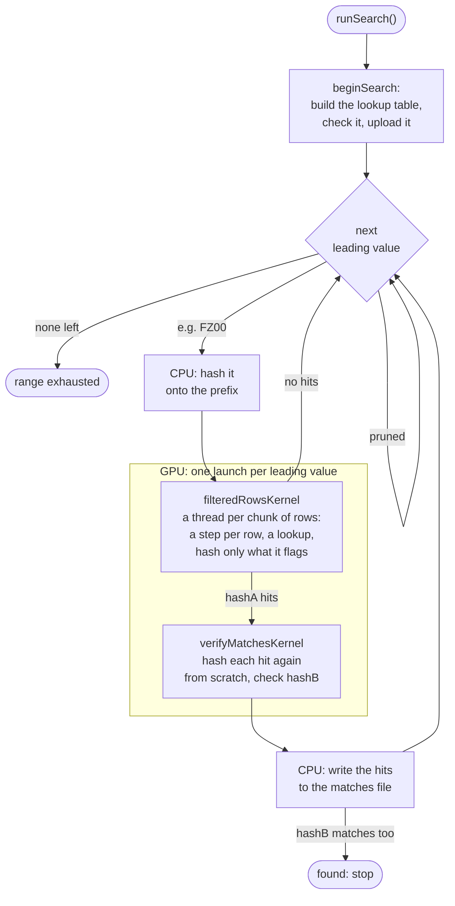
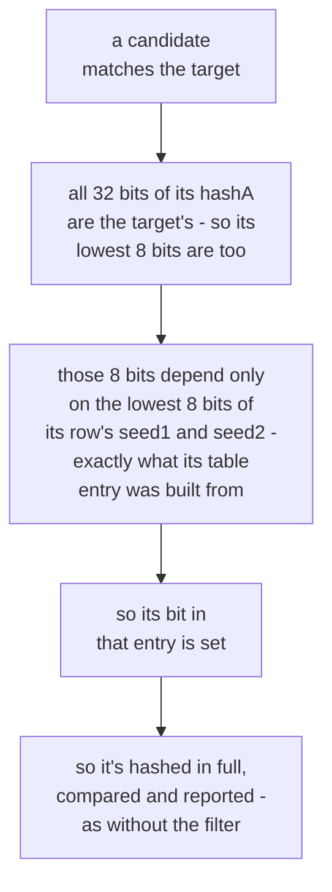
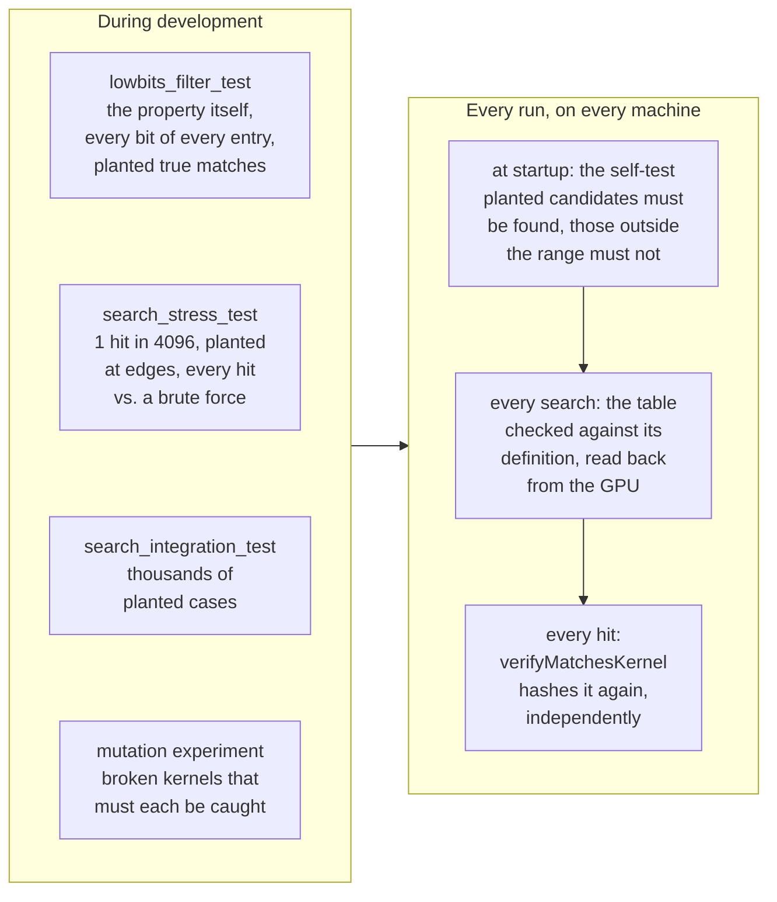

# namebreak-bombe

A GPU-accelerated MPQ filename brute-forcer. MPQ archives (used by Blizzard
games like StarCraft, Diablo, and Warcraft III) index their files by a pair
of 32-bit hashes of the filename rather than storing filenames directly, so
recovering an unknown filename means finding a candidate string that hashes
to both target values. `namebreak` does that by generating every candidate
in a given alphabet and length range and hashing each one on the GPU via
CUDA. For background on MPQ hashing and why this works at all, see
[zezula.net's writeup](http://zezula.net/en/mpq/namebreak.html).

Every filename `namebreak` searches has the shape **prefix + candidate +
suffix** - the prefix and suffix are fixed, known strings (e.g. `REZ\` and
`.WAV`), and the candidate is the unknown part being brute-forced.

## Modes

`namebreak` runs in one of three modes, set via `config.conf`'s `mode = ...`
(or overridden by passing `--mode <mode>`, e.g. `build/namebreak --mode bounded`).
A different config file can be used instead of `config.conf` via
`--config <file>`.

It searches on the first backend (see [Backends](#backends)) that can run
on the machine - normally the GPU. A top-level `backend = <name>` line in
`config.conf`, or `--backend <name>`, picks one instead; running with an
unknown name lists the ones the build has.

- **`bounded`** - exhaustively searches candidates of exactly
  `start_candidate`'s length (or `lower_bound`'s, without one), between
  `lower_bound` and `upper_bound`, then exits.
- **`continuous`** - same as `bounded`, but once a length is exhausted it
  moves on to the next candidate length and keeps going indefinitely (up to
  `MAX_CANDIDATE_LEN`, 16 characters).
- **`coordinator`** - registers with a central coordinator server, claims a
  range of a shared target's search space, searches it, and reports back;
  repeats until stopped. See [`../coordinator/README.md`](../coordinator/README.md)
  for the server side and how this mode is configured.

Exit code is `0` if both hashes matched, `2` if the search space was
exhausted without a match, `1` on any setup/config error.

## Version and updates

`namebreak -v` (or `--version`) prints which release this is - the GitHub
release tag it was built for, like `v2026-09-26`, or `dev` for a build that
isn't a release (see `NAMEBREAK_VERSION` under [Compiling](#compiling)).

At startup, a release build looks up the latest release on
[GitHub](https://github.com/sjoblomj/namebreak-bombe/releases) and, if
there's a newer one, says so and where to get it. It never downloads
anything, and says nothing if the lookup fails. A top-level
`check_for_updates = false` line in `config.conf` turns this off. A build
without networking (`NAMEBREAK_NETWORK=OFF`) never looks.

In `coordinator` mode, the server can refuse a release it considers too old.
namebreak then shows the server's message, saying what to get, and quits.

## Pausing

Press `p` (or `P`) at any point while `namebreak` is running interactively
to pause the search - the same key cgminer/xmrig and other long-running GPU
compute tools use for this. The GPU batch already in flight always finishes
normally; no new one starts until `p` is pressed again to resume. Ctrl+C
pauses too, on the first press - a reflexive Ctrl+C doesn't lose the run
outright, since a pause is trivially undone. A second Ctrl+C, while already
paused by either method, actually quits. In `coordinator` mode,
heartbeating keeps going while paused (it runs on its own thread,
independent of the search itself), so a paused client doesn't lose its
claimed range to a lease timeout - it just makes no progress on it until
resumed. No new range is claimed while paused.

Also in `coordinator` mode, `f` (or `F`) means "finish the current range,
then pause": the client carries on with the range in hand, reports it
complete, and pauses before claiming new work. Pressed while paused, it
resumes the search for the rest of that range; pressed while running, it
just arranges the pause. `p` still pauses and resumes in the meantime
without cancelling it, and pressing `f` again cancels it, so the client
carries on claiming new work as usual. With no range in hand (paused
between ranges, or waiting for work), it pauses right away. The Windows GUI
has the same option as a "Finish current range, then pause" checkbox, and
in its tray menu.

Keys are only available when stdin is an actual interactive terminal
(not when redirected/piped, or with no controlling terminal at all, e.g. a
cron job or systemd service) - `namebreak` prints `Press 'p' to
pause/resume the search.` on startup when it is.

## Configuring

`namebreak` reads `config.conf` from the current working directory, or the
file given with `--config <file>`, every time it starts; without one it
stops and says what the smallest working one looks like (the Windows GUI
runs its setup dialog instead, and writes one). It's a flat `key = value`
file with up to two `[section]` blocks; `#`-led lines and blank lines are
ignored, and a value only needs `"..."` quoting if it has meaningful
leading/trailing whitespace (a literal `\` needs no escaping).

```ini
mode = continuous

[search]
alphabet = " !&'()+,-.0123456789ABCDEFGHIJKLMNOPQRSTUVWXYZ[]_"
max_backslash_count = 0
prefix = REZ\
suffix = .WAV
lower_bound = REZ\FINZ09BX.TXT
upper_bound = REZ\GAMEMENU.BIN
hash_a = 0xF60F5D90
hash_b = 0xCE0A9BDB
prune_symbol_runs = true
prune_unopened_brackets = true
resume_from_last_candidate = true
```

`[search]` keys (used by both `bounded` and `continuous` mode):

| Key | Required | Meaning |
|---|---|---|
| `alphabet` | yes | Every character a candidate may contain. Size must be one of `29, 30, 40, 41, 42, 43, 47, 48, 49, 50` (see [Compiling](#compiling) for why) and at most `MAX_ALPHABET_SIZE` (50). |
| `max_backslash_count` | yes | Max `\` occurrences allowed in a candidate before it's skipped; `0` means unlimited. To forbid `\` entirely, leave it out of `alphabet` instead - `0` is "no limit", not "zero allowed". |
| `prefix` / `suffix` | yes | The fixed parts of the filename around the candidate. |
| `start_candidate` | no | Full filename (prefix+candidate+suffix) to begin searching from. Without it, the search starts from the beginning: in `continuous` mode the shortest candidates (as if it were just prefix+suffix - that filename itself isn't checked), in `bounded` mode, which searches only one candidate length, `lower_bound`. |
| `resume_from_last_candidate` | no (default `false`) | Resume from the last line of the matches file (see below), the most recent Hash-A match - so a stopped search can simply be restarted to carry on from about where it was. If there's also a `start_candidate`, it starts from whichever of the two the search reaches later (longer candidates come after shorter ones). A last line that doesn't belong to this search - another prefix or suffix, or characters outside `alphabet`, since `bounded`/`continuous` searches share one matches file - is ignored, with a note. Either way, the search prints the candidate it starts from. |
| `lower_bound` / `upper_bound` | yes | Full filenames (inclusive) bounding the search alphabetically, at every candidate length searched. |
| `hash_a` / `hash_b` | yes | The two target MPQ hashes, hex (`0x` prefix optional). |
| `prune_symbol_runs` | no (default `false`) | Skip candidates containing 3+ consecutive non-alphanumeric, non-space characters (real MPQ filenames essentially never have runs like that) - see [Design decisions](#design-decisions). |
| `prune_unopened_brackets` | no (default `false`) | Skip candidates that close a bracket never opened: reading left to right, a `)` at a point where more `)` than `(` have been seen, or likewise a `]` with `[`. The two kinds are counted separately (how they nest within each other isn't checked). Brackets left open by `prefix` count as opened, so a candidate may close those - see [Design decisions](#design-decisions). |

`[coordinator]` keys (`coordinator` mode only) are `server_url` (required),
plus optional `username`, `hostname` (auto-detected and interactively
confirmed if omitted), and `poll_interval_secs` (default `30`) - see the
coordinator README linked above for the full picture.

Every Hash-A match (a candidate matching the first hash, whether or not it
matches the second) is appended to a matches file, one filename per line.
They all go in one directory - `matches/` in the current directory, or
whatever a top-level `matches_dir = <directory>` line (next to `mode`) says;
it's created if missing. `bounded`/`continuous` mode writes `matches.txt`
there, and `coordinator` mode one `matches-<target name>.txt` per target.

## Compiling

Requires CMake (3.24 or later), the CUDA Toolkit (`nvcc`), a CUDA-capable
GPU, and libcurl. The build is described by `CMakeLists.txt`, and
`CMakePresets.json` has the usual configurations - CLion and Visual Studio
pick those up directly.

```sh
cmake --preset default            # configure into build/
cmake --build --preset default    # builds build/namebreak, and the tests in build/tests/
ctest --preset default            # runs the tests
```

Options, passed to the first command as `-D<option>=<value>`:

| Option | Default | Meaning |
|---|---|---|
| `CMAKE_CUDA_ARCHITECTURES` | `86` | The GPU's compute capability, without the dot (`nvidia-smi --query-gpu=compute_cap --format=csv`), or `native` |
| `NAMEBREAK_NETWORK` | `ON` | `OFF` leaves out coordinator mode, the update check and the libcurl dependency |
| `NAMEBREAK_VERSION` | `dev` | The release this build is, e.g. `v2026-09-26` - what `--version` prints, and what the update check and the coordinator compare. The release workflow sets it to the tag it builds |
| `NAMEBREAK_GPU` | `cuda` | `hip` builds the HIP backend for AMD GPUs instead (needs ROCm or the HIP SDK; the `hip` preset, into `build-hip/`, with `CMAKE_HIP_ARCHITECTURES` e.g. `gfx1100` - unset, CMake asks ROCm). `none` builds without either, leaving the CPU backends and OpenCL - or use the `portable` preset, which builds into `build-portable/` |
| `NAMEBREAK_METAL` | `AUTO` | The Metal backend: `AUTO` builds it on macOS (Xcode's command line tools are all it needs), `OFF` leaves it out |
| `NAMEBREAK_OPENCL` | `AUTO` | The OpenCL backend: `AUTO` builds it if OpenCL's headers and loader library are found (on Debian/Ubuntu: `opencl-headers ocl-icd-opencl-dev`; on Windows e.g. vcpkg's `opencl`), `ON` insists, `OFF` leaves it out |
| `NAMEBREAK_BENCH_WINDOW` | *(empty)* | A different GPU window for `search_bench` only, e.g. `6` |

On Windows, use a Visual Studio developer prompt (MSVC is the host compiler
the CUDA Toolkit supports there) and point CMake at a libcurl, e.g. vcpkg's:
`cmake --preset default -DCMAKE_TOOLCHAIN_FILE=C:/vcpkg/scripts/buildsystems/vcpkg.cmake`.
That also builds the GUI, `namebreak-gui.exe`. There's no Windows machine
with CUDA to verify this on; the CPU-only build has been cross-compiled with
MinGW-w64, and its tests pass under Wine.

The alphabet's *size* (not its exact characters) is baked into the binary as
a compile-time template instantiation per size, for performance - the fixed
set of sizes this build supports (`29, 30, 40, 41, 42, 43, 47, 48, 49, 50`) is checked early
and fails fast with a clear message if `config.conf`'s alphabet doesn't
match one of them. Supporting a new size means adding it to
`SupportedAlphabetSizes` in `src/backends/cuda/cuda_backend.cu` and
recompiling.

`ctest` runs the correctness test suite: pure-CPU unit tests (among them
`lowbits_filter_test`, of the lookup filter), plus
end-to-end tests of every backend that compare real search results against
an independent brute-force reference (thousands of cases: every supported
alphabet size, every last-character position, ranges starting/ending mid-row and
crossing launch boundaries, prefix/suffix lengths 0-63 including bytes >=
0x80, the both-hashes-match path, and a seeded fuzzer), and the dense-hit
stress tests (`stress-*`), which make one candidate in 4096 a hit and
compare every one of them with a brute force - see [The lookup
filter](#the-lookup-filter-most-candidates-are-never-hashed). The search is
built in several configurations for this (different GPU window, launch
sizes and rows per thread, the stress tests' weaker match, a one-bit
filter), each with its own
compile of the CUDA backend - the build runs them in parallel.
`cmake --build --preset default --target run_search_bench` times the real
search over a fixed range (`build/tests/search_bench --scale <n>` for a
longer one), and `--target run_mutation_test` (and
`run_mutation_test_opencl`) checks that the tests catch deliberately broken
kernels - see [The lookup
filter](#the-lookup-filter-most-candidates-are-never-hashed) - which takes
minutes, so it isn't part of `ctest`. Everything is built into `build/`; deleting it is the clean
build.

## Releases

Pushing a version tag (`git tag v2026-09-26 && git push origin v2026-09-26`)
runs `.github/workflows/client-release.yml`, which builds the client for Linux
(CUDA + OpenCL + CPU, and a separate AMD/HIP build), Windows (CUDA + OpenCL +
CPU, and the GUI) and macOS on Apple Silicon (Metal + OpenCL + CPU), runs the
tests on each, and attaches the archives to a GitHub release for the tag. A
build that fails is left out and the release is created as a draft instead.
Tags must be the release date, `vYYYY-MM-DD`, with `.1`, `.2`, ... added for
a later release the same day: that's how releases are ordered, both by the
client's update check and by the coordinator's minimum release. Each build is made with `NAMEBREAK_VERSION` set to the tag. The
workflow can also be started by hand from the Actions tab, to get the same
builds (as `dev`) without a release. The runners have no GPUs, so only the CPU
backends' tests actually run there.

## Source layout

| Directory | What's in it |
|---|---|
| `src/engine/` | The search itself: `runSearch()`, candidate/bound arithmetic, hashing on the CPU |
| `src/backends/` | What the search runs its batches on (see Backends below) |
| `src/common/` | The config file, and the few OS-specific helpers (terminal, hostname) |
| `src/net/` | The coordinator client: HTTP, the wire protocol, the claim/heartbeat loop (left out by `NAMEBREAK_NETWORK=OFF`) |
| `src/cli/` | The console program's `main()` |
| `src/gui/win32/` | The Windows GUI (Windows only) |
| `tests/` | Correctness tests and benchmarks (`ctest`, `run_search_bench`), and the mutation experiment (`mutation_test.py`, `run_mutation_test`) |
| `scripts/` | The generator for the GUI's embedded icon |

Includes are written relative to `src/` (e.g. `#include "engine/search.h"`).

### Backends

`runSearch()` (`src/engine/search.cpp`) walks the search space and does
everything that isn't hashing - validation, bounds, the leading/trailing
split, pruning, pause/abort, writing matches. It hands each chunk of
candidates to a *backend* (`SearchBackend`, `src/engine/backend.h`), which
hashes them and returns the hits. `src/backends/backends.cpp` lists the
backends a build has, most preferred first; unless told otherwise (see
[Modes](#modes)) the program uses the first one that can run on the machine,
so a GPU build still works on a machine without that GPU:

- `cuda/` - the CUDA kernels and the code that launches them, with [the
  lookup filter](#the-lookup-filter-most-candidates-are-never-hashed)
  (`common/lowbits_filter.h`) and row groups split into chunks: about
  1,450-1,700 G candidates/s on the RTX 3080 Ti Laptop, depending on how
  hot it is.
- `hip` - AMD GPUs: `cuda/`'s code compiled with ROCm's HIP instead, which
  accepts CUDA's kernel syntax as is; `gpu_runtime.h` maps the handful of
  CUDA runtime calls onto HIP's. So it has everything the CUDA backend has,
  lookup filter and row groups included. Not built by default, and not yet
  tested on an AMD GPU: it has only been run through HIP's NVIDIA mapping,
  on an NVIDIA GPU, where every test passes, stress tests included (see
  [PERFORMANCE.md](PERFORMANCE.md) for what that does and doesn't cover).
- `metal/` - the Mac's GPU (Apple Silicon, or an Intel Mac's), through
  Metal: the OpenCL kernel, lookup filter, row groups and all, in Metal's
  shading language (`search.metal`), compiled by Metal at runtime the same way; the
  host side is Objective-C++ (`metal_backend.mm`). On a Mac, use the
  `portable` preset. Not yet run on a Mac: its kernel has only been tested
  on the CPU, compiled as C++ against a stand-in for Metal's standard
  library and run one GPU thread at a time behind a C++ transcription of
  `metal_backend.mm`, where every test configuration, the stress tests and
  the kernel's mutation experiment pass; `metal_backend.mm` itself has
  never been compiled.
- `opencl/` - any GPU with an OpenCL driver: AMD, Intel (including
  integrated ones) and NVIDIA, with nothing but the vendor's regular driver
  installed. CUDA's kernel ported (`search.cl`), lookup filter, row groups
  and all - with a whole row group per work-item, which suits it best; it's
  compiled by the driver at runtime, once per alphabet size, suffix length
  and trailing length, so it takes an alphabet of any size - drivers cache
  the result, but a new combination's first search starts a moment later.
  About 1,300-1,460 G candidates/s on the RTX 3080 Ti Laptop, depending on
  how hot it is - six to seven times what it did before it got the filter, and
  close to the CUDA backend.
- `cpu/` - every core of the CPU, with the same row trick as the CUDA
  kernel and the candidates of a row hashed several at a time with SIMD
  instructions (AVX2 on x86-64 CPUs that have it, picked at runtime; SSE2
  or NEON otherwise). About 9 G candidates/s on a laptop i9-12900H - far
  below its GPU, but it lets any machine contribute. Every build has it.
  (A prototype of it with the lookup filter was about 4.6 times as fast -
  see [PERFORMANCE.md](PERFORMANCE.md).)
- `reference/` - one thread, every candidate hashed from scratch. Far too
  slow for real searches, but simple enough to be obviously right: it's what
  the others are held to. Every build has it.

`ctest` runs the end-to-end tests against every backend in the build; a
test whose backend can't run on the machine is reported as skipped (one
whose backend fails its self-test on the machine fails). A new
backend implements `SearchBackend`, gets a directory under `src/backends/`
and an entry in `backends.cpp` and `CMakeLists.txt`, and is covered by the
same tests: they take a `--backend <name>` argument.

## Design decisions

### A search, end to end

Every filename a search tries is split into parts that different pieces of
the program deal with. Here, `REZ\FZ00ODMEA.WAV` - a 9-character
candidate between the prefix `REZ\` and the suffix `.WAV`, with the default
window of 5 trailing characters:

```text
  R E Z \ F Z 0 0 O D M E A . W A V
  └──┬──┘ └──┬──┘ └─┬─┘ │ │ └──┬──┘
     │       │      │   │ │    └───── suffix: fixed
     │       │      │   │ └────────── the candidate's last character  ┐
     │       │      │   └──────────── the row's last character        ├ trailing: the GPU
     │       │      └──────────────── the row group's characters      ┘
     │       └─────────────────────── leading: the CPU, one value at a time
     └─────────────────────────────── prefix: fixed
```

The CPU walks through every value of the leading characters (see the next
section), and for each one the GPU searches every combination of the
trailing ones: in *rows* (every trailing character but the last fixed),
which come in *row groups*, of which each GPU thread takes a *chunk* (see
[How the GPU kernel is structured](#how-the-gpu-kernel-is-structured)). A lookup table
then tells it which of a row's candidates could match at all, so that only
those are hashed in full (see [The lookup
filter](#the-lookup-filter-most-candidates-are-never-hashed)). With the real
49-character alphabet, one leading value is 49^5 = 282,475,249 candidates:
5,764,801 rows of 49, in 117,649 row groups of 49 rows, in 235,298 chunks of
24 or 25 rows - one per GPU thread, in a single kernel launch.



### The GPU doesn't brute-force the whole candidate

Only a small, fixed-size trailing window of each candidate
(`NAMEBREAK_GPU_WINDOW_CHARS` characters, currently 5, set in
`src/backends/cuda/tuning.h`) is enumerated directly on the GPU. Anything beyond that is treated as an extension of the prefix: every
combination of those leading characters is enumerated on the CPU and its
hash contribution folded in once (incrementally - O(1) amortized per step,
not a full rehash) before the GPU launches for that leading value. The
window is bounded above (`kMaxTrailingLen`, 6, in the same file) because the
kernel indexes rows with 32-bit integers.

The window is a launch-size knob more than a per-thread-cost knob (see
below), and 5 measured best on the reference hardware with the kernel as it
was before [the lookup filter](#the-lookup-filter-most-candidates-are-never-hashed)
(about 155 G candidates/s at a window of 4, 222 at 5, 216 at 6): a window
of 4 makes each leading value's launch so short (~25 us) that per-launch
overhead becomes a large fraction of the runtime. The lookup filter and the
row chunks made every launch about seven times shorter, so this is worth
measuring again - see [PERFORMANCE.md](PERFORMANCE.md). Note the window
also decides how much `prune_symbol_runs`/`prune_unopened_brackets`/`max_backslash_count`
can see (they only examine the leading characters, see below): a larger window means fewer
characters are pruned on, so those settings skip slightly fewer
candidates than they did at a window of 4 (never more).

### How the GPU kernel is structured

Hashing a candidate means feeding its characters through the hash function
one at a time, each step depending on the one before it. That means two
candidates sharing the same first few characters redo the exact same first
few steps, if hashed independently - wasted, repeated work.

The kernel avoids that by working on **rows** instead of individual
candidates. A row is one fixed value for every trailing character *except
the last* - e.g. with a 3-character trailing window and alphabet `A..Z`,
the row `XY*` covers the 26 candidates `XYA`, `XYB`, `XYC`, ... `XYZ`. One
GPU thread owns one whole row: it hashes the shared part (`XY`) exactly
once, then loops just the last character over the alphabet, reusing that
one result for every candidate in the row. So each of those 26 candidates
costs only one more character step plus the suffix, instead of every one
of them separately re-hashing the whole trailing window from scratch.

One kernel launch doesn't necessarily cover a whole leading value's
trailing space at once, though - it covers at most
`NAMEBREAK_ROWS_PER_LAUNCH` rows (8,388,608 by default, set in
`src/backends/cuda/tuning.h`), and always a whole number of them: a launch's
boundaries land on row boundaries, except possibly at the very start or end of the
range being searched. That's what makes the window above a *launch-size*
knob rather than only a per-thread-cost one - and it's also what bounds how
long any single launch can run for, since pause and abort are only checked
*between* launches, not in the middle of one.

So only a launch's first and last row can be cut short. With the
3-character window and `A..Z` from above, a launch from `XDJ` to `YKT`:

```text
                 A B C D E F G H I J K L M N O P Q R S T U V W X Y Z
 first row  XD*  . . . . . . . . . x x x x x x x x x x x x x x x x x  <- firstRowStartK = 9 (J)
            XE*  x x x x x x x x x x x x x x x x x x x x x x x x x x
            ...  every row in between: all of it
 last row   YK*  x x x x x x x x x x x x x x x x x x x x . . . . . .  <- lastRowEndK = 20 (to T)
```

The CUDA kernel takes this one step further. Consecutive rows share even
more than their candidates do: the rows `XA*`, `XB*`, ... `XZ*` all start
with `X`. So a *row group* - the rows that share every trailing character
but the row's own last - is split into chunks of about
`NAMEBREAK_ROWS_PER_THREAD` consecutive rows (25, in `tuning.h`: two chunks
per group for a 49-character alphabet), and one thread takes a chunk: it
hashes the group's shared characters once, and each of its rows then costs
one more step, instead of every thread working out its row's characters
from its number (a division per character) and hashing all of them. A chunk
never crosses into another group, and the kernel walks all the chunks of a
launch itself, so how many threads are launched only decides how the work
is shared out, never what gets searched. That made the search about a third
faster again (1,088-1,124 to 1,434-1,467 G candidates/s, three runs each
side by side; 1 row per thread measured 1,133, 7 rows 1,575, 25 rows 1,659
and 49 rows 1,611 in a cooler run). The OpenCL kernel does the same, but
does best with a whole row group per work-item (1 row per work-item measured
about 880, 7 about 1,300, 25 about 1,435, and 49 and 64 about 1,460). The
Metal kernel does the same, with CUDA's 25 rows per thread until it has
been measured on a Mac (see [PERFORMANCE.md](PERFORMANCE.md)).

Group `X**` from above, with its 26 rows split into two chunks of 13 (26
characters, 25 rows per thread), marked with what the lookup filter
described below does to each candidate - `#`: flagged, hashed in full; `·`:
never hashed. (Where the `#`s fall here is made up; a row has
alphabetSize / 256 of them on average.)

```text
                     last character
                     A B C D E F G H I J K L M N O P Q R S T U V W X Y Z
              ┌ XA*  · · · · · · # · · · · · · · · · · · · · · · · · · ·
              │ XB*  · · · · · · · · · · · · · · · · · · · · · · · · · ·
 thread 1:    │ ...
 chunk 0      │ XL*  · · · · · · · · · · · · · · · · · · · · · · · · · ·
              └ XM*  · · · · · · · · · · · · · · · · · · · # · · · · · ·
              ┌ XN*  · · · · · · · · · · · · · · · · · · · · · · · · · ·
 thread 2:    │ ...
 chunk 1      │ XY*  · · · · · · · · · · · · · · · · · · · · · · · · · ·
              └ XZ*  · # · · · · · · · · · · · · · · · · · · · · · # · ·
```

Thread 1 hashes `X` once, then one more character for each of `XA*` to
`XM*`; thread 2 does the same for `XN*` to `XZ*`. Every row then costs one
table lookup, and only its `#`s are hashed any further.

What a thread then does with its rows: the GPU kernels
(`filteredRowsKernel`, `search.cl`, `search.metal`) look each row up in a
table and hash only the handful of its candidates that could possibly
match, as [The lookup filter](#the-lookup-filter-most-candidates-are-never-hashed)
below explains. Before they had the filter, they hashed every candidate of the row,
as the CPU backend still does, which two more things made fast:

- **The loop over the last character is fully unrolled**, with its
  alphabet position known at compile time for every iteration. That lets
  the compiler bake each character's hash-table value directly into the
  generated instructions, instead of looking it up from memory at runtime.
  This matters because GPU threads execute in lockstep, 32 at a time (a
  "warp") - a runtime lookup where each of those 32 threads needs a
  different table entry serializes the whole warp, one lookup at a time,
  while a compile-time constant costs nothing extra.
- **The suffix length is a compile-time parameter too** (for lengths 0-8;
  longer suffixes fall back to a slower runtime-length loop), for the same
  reason. The CUDA kernel still does this for the candidates it does hash.

Together, the row-based design measured about 16x faster than the
previous one-thread-per-candidate kernel, while still producing
bit-for-bit identical hashes.

The search kernel only *records where* each hashA hit is - it doesn't build
the filename or check hashB, keeping its hot path as small as possible. A
second, much smaller kernel (`verifyMatchesKernel`) runs only when a batch
actually had a hit: it rebuilds that candidate's complete filename and
checks hashB - using the *original*, independent hashing code (not
the row-based fast path), so every hit gets cross-checked by a second
implementation at runtime. Any disagreement between the two prints a
`WARNING`, which the test suite treats as a failure.

Only the first `MAX_MATCHES` (1024) hits from one launch can be recorded
at all. If a launch somehow has more than that, its range is searched
again as two halves (recursively, if needed), so every hit still gets
checked against hashB rather than silently lost. With a real 32-bit hash
this essentially never happens in practice (it would take over a thousand
collisions in a single launch), but it's handled explicitly and tested
(`tests/search_overflow_test.cpp`).

### The lookup filter: most candidates are never hashed

The GPU backends - CUDA, OpenCL and Metal - don't hash every candidate of a
row. In the real search (a 49-character alphabet and `.WAV`) they hash about one in
256 - on average 0.19 of a row's 49 candidates - because they can tell from
a single table lookup that the rest can't match. That made the whole search
5.2 times as fast with CUDA (`search_bench --scale 20` on the RTX 3080 Ti
Laptop, three runs each: from 209-218 to 1,084-1,130 G candidates/s) and
5.3 times with OpenCL (from 202-205 to 1,082-1,086), without skipping
anything a full search would find.

**Why it works.** Every step of the MPQ hash is

```
seed1 = key[ch] ^ (seed1 + seed2)
seed2 = ch + seed1 + seed2 + (seed2 << 5) + 3
```

It's only additions, an XOR, a left shift and constants; the crypt table is
indexed by the character, never by the hash state. In each of those, bit
*i* of the result depends only on bits 0..*i* of what goes in: an
addition's carries only travel upward, an XOR works bit by bit, and a left
shift only moves bits upward. So the same holds for any number of steps:
**the lowest *n* bits of hashA depend only on the lowest *n* bits of the
state it's computed from** (and on the characters).

For example, the row `REZ\FZ00ODME*` of the real search, and its candidate
with the last character `A`. Whatever the 24 high bits of its state are,
the steps for `A` and then `.WAV` end with the same 8 lowest bits:

```text
   bit                31                     8   7      0
                    ┌──────────────────────────┬──────────┐
   seed1            │ ???????????????????????? │ 00100010 │  0x22
   seed2            │ ???????????????????????? │ 10110011 │  0xB3
                    └──────────────────────────┴──────────┘
   + A, then .WAV:
     seed1 + seed2   a carry only ever moves one bit left, to the next bit up
     key ^ ...       every bit on its own
     seed2 << 5      every bit moves 5 places left
                    ┌──────────────────────────┬──────────┐
   hashA            │ ???????????????????????? │ 10010000 │  0x90, whatever the ?s were
                    └──────────────────────────┴──────────┘
                      the ?s can never reach these 8 bits: bits only move <-- this way
```

All of a row's candidates continue from the same state (seed1, seed2) - the
one after the row's shared characters - with one last character, then the
suffix. So which of them have a hashA whose lowest 8 bits are the target's
depends only on the lowest 8 bits of seed1 and of seed2: 65,536
possibilities. Before a search, the backend works out, for each of them,
which last characters give the target's lowest 8 bits, as a 64-bit mask
with one bit per alphabet character - a 512 KB table
(`buildLowBitsFilterTable`, `src/backends/common/lowbits_filter.h`). Each
thread looks its row up in it and hashes only the candidates in the mask,
in full, exactly as before.

The same row, looked up for the real target (every number here is computed,
not made up):

```text
  row REZ\FZ00ODME* of the real search, target hashA 0xF60F5D90

  the state after REZ\FZ00ODME        seed1 = 0xA2E45422      seed2 = 0xCC16ABB3
                                                      ──                      ──
  their lowest 8 bits                               0x22                    0xB3
                                                       └───────────┬───────────┘
  the table entry (seed2's 8 bits, then seed1's)                 0xB322
                                                                   │
                                                                   v
  the entry: a bit per last character, from '_' (bit 48) down to ' ' (bit 0)
     0000000000000000000000000000100000000000000000010
                                 │                  │
                            bit 20: 'A'        bit 1: '!'
                                 │                  │
                                 v                  v
                         REZ\FZ00ODMEA.WAV  REZ\FZ00ODME!.WAV
                         hashA 0x94857290   hashA 0x751A4590

  Both are hashed in full: their lowest 8 bits are 0x90, as the entry said,
  but neither is 0xF60F5D90. The row's other 47 candidates are never
  hashed at all - the entry says they can't match.
```

**Why it can't miss a match.** A candidate that matches the target has all
32 bits of its hashA equal to the target's - in particular the lowest 8.
Those 8 bits are, by the property above, exactly what its row's table entry
was computed from (with the state's higher bits set to 0, which can't change
them), so its bit is set, and it's hashed and compared just as it was before
there was a filter. The filter only ever leaves out candidates whose hashA
differs from the target's in its lowest 8 bits: candidates that can't match.
Nothing else about a candidate - its prefix, its leading characters, the
rest of its row's state - can change that; they only reach the state's
higher bits.



**What guards the implementation.** The argument is short; the risk is code
that doesn't follow it - a table built for the wrong target, an index with
seed1 and seed2 swapped, a bit past the 32nd character lost - which would
skip matches silently, with no other symptom. So, on top of the tests every
backend already had, there are checks in development and on every run:



In detail:

- `tests/lowbits_filter_test.cpp` checks the property itself on the real
  hash step (for every *n* from 1 to 32, arbitrary characters and
  suffixes); every bit of every entry of 27 tables (the real search's, and
  random alphabets, suffixes of up to 63 bytes, bytes >= 0x80, random
  targets), each from states with *random* high bits - which checks the
  table's layout and the index function the kernel uses, not just the
  builder; that 300 planted true matches (a random state and character,
  with the target set to exactly their hashA) all get through; and that
  its table check really catches a wrong table: one flipped bit, a bit past
  the alphabet, a table for another target or another suffix, seed1 and
  seed2 swapped.
- `tests/search_stress_test.cpp` runs the real `runSearch()` with hits made
  common: built with `NAMEBREAK_HASHA_MATCH_BITS=12`
  (`src/engine/hash_match.h`), a candidate is a hashA hit when the lowest 12
  bits match - one in 4096. Hundreds of random ranges (random alphabets,
  prefixes, suffixes and lengths, ranges across leading values and at both
  ends of the space) are compared hit for hit with a brute force that hashes
  every candidate from scratch: tens of thousands of hits per run, in every
  position of every row, where the other tests see the few they plant. Each
  case also plants a hit where a kernel is likeliest to be wrong - a range's
  first or last candidate, either side of a leading-value or batch
  boundary, a row's first or last character - or just outside the range,
  where it must not be reported. It runs in every geometry the integration
  test does, with a one-bit filter too (`NAMEBREAK_LOWBITS_FILTER_BITS=1`:
  about half of each row gets through), and on every backend.
- Before every search, the GPU backends check 1,024 random
  entries of the table they have just built against their definition (the
  test's check, from random high bits), upload it, and read it back to
  compare. If either
  fails, namebreak stops (`INTERNAL ERROR: the lookup filter table ...`)
  rather than search with it; in coordinator mode the range is reassigned
  once its lease expires.
- Before any backend is used, `createBackend` runs a known-answer self-test
  on it (`src/backends/self_test.h`), on the machine it's about to search
  on: candidates planted in small batches - at the first and last character
  positions, on both sides of bit 32 of the mask, in rows cut short at both
  ends, as the very first and very last candidate of a batch, with an
  empty, an 8-byte and a long non-ASCII suffix - must be found, and
  candidates planted just outside a batch must not be. It takes well under
  a second. The tests
  only run where someone runs them (the release workflow's runners have no
  GPU); this runs on every volunteer's GPU, driver and compiler. A backend
  that fails isn't used: namebreak says so and falls back to the next one
  (for a GPU backend, eventually the CPU).
- `verifyMatchesKernel` still cross-checks every hit through the
  independent hashing path, as before.
- The `reference` backend never gets the filter: it's what the others are
  held to.

To check that these checks would actually catch a broken kernel, broken
ones are built on purpose - each a bug that silently misses (or invents)
candidates - and run against each check on its own (the integration and
stress tests with the self-test switched off). `tests/mutation_test.py`
does it, a backend at a time: `cmake --build --preset default --target
run_mutation_test` for the CUDA kernel (about seven minutes on the RTX 3080
Ti Laptop), `run_mutation_test_opencl` for the OpenCL one (about four).
Run it after any change to a kernel - and when it
says a mutation no longer applies, because the code it breaks has changed,
update the mutation rather than drop it. It first checks that the unchanged
code passes all three checks, and that a change which mustn't matter (one
thread, or one work-group, too few or too many launched) passes them too, so
that it can't pass by always saying "caught". Against the CUDA kernel as it
is now, with row groups split into chunks, eighteen mutations: rows' masks cut to
32 bits; seed1 and seed2 swapped in the lookup; a launch's last row, or
first row, one candidate short; the edges of the range ignored; the loop
over a row's flagged candidates stopping one early; the suffix hashed one
character short; the table built for the wrong target; and, in the
chunking, a chunk's first or last row skipped; the range cut one row short
at its start or end; the first or last row's cut applied to the wrong row;
one character too few of a group hashed; the wrong character in a row's
own step; the last chunk, or the last group, of a launch never searched.
Every one was caught by the self-test, by the integration test and by the
stress test - the integration test failed 6-1007 of its 2,267 cases, the
stress test 38-292 of its 321, and the wrong-target table stopped both at
their first search. Against the OpenCL kernel, twenty-one: the same kinds
of bug in its mask, lookup, row edges, loop, suffix and chunking, plus a
lowest-set-bit taken one too high, its own copy of the table index shifting
one bit too far, and the kernel compiled for a table one bit narrower - with
half as many work-items, and a work-group too many, as the changes that
mustn't matter. Every one was caught by all three checks too (the
integration test failed 6-1007 of its 2,266 cases, the stress test 48-394 of
its 436), each time the script was run on it. The Metal kernel has its own
list (`--backend metal`, on a Mac); with no Mac here, its kernel mutations
were run through an emulation of Metal on the CPU (see [Backends](#backends)),
and each was caught by all three checks there too, while half as many
threads, or a threadgroup too many, went unnoticed, as they must.

Each round of this found something. The first one added the self-test's
and the stress test's planted edge cases: before them, a launch whose last
row was one short got past both, and only the integration test caught it.
The second made the self-test plant candidates in the first and last row of
a row group, where it had missed a chunk's last row being skipped; and it
found that launching one thread too few went unnoticed by everything - it
only mattered when the thread count was just past a multiple of 256 - so
the kernel now works out its chunks itself, and how many threads are
launched can no longer change what gets searched.
`tests/self_test_test.cpp` does the same for the self-test on the CPU
backends, on every `ctest` run.

If the code changes, two things must stay true for the filter to be right:
the hash step may only combine the state with additions, subtractions,
multiplications, AND/OR/XOR, left shifts and constants - never a right
shift, a rotation, a division, a comparison, or a table lookup indexed by
the state - and a hashA hit must always mean the *low* bits match
(`hashAMatches`), which is why the stress tests' weaker match drops high
bits and never low ones. What none of this can rule out is the hardware
computing something wrong (consumer GPUs have no ECC memory) - as true
before the filter as after; [PERFORMANCE.md](PERFORMANCE.md) lists a
coordinator-side check that would catch it, along with the further speedups
still open.

### `prune_symbol_runs`, `prune_unopened_brackets` and `max_backslash_count` only run on the CPU

All three are cheap heuristics for skipping implausible candidates before
spending a hash chain on them - not correctness rules (a real match could in
principle violate any of them; these just trade a small amount of
completeness for a lot of throughput). They're applied only to the CPU-
enumerated *leading* characters described above, never to the GPU-brute-
forced trailing window - and this was a deliberate choice, tried and
measured, not an oversight:

- **Skipping an entire leading value on the CPU is essentially free.** It
  skips that value's whole trailing batch (potentially millions of
  candidates) before any GPU work is launched at all - one CPU-side decision
  is all it costs.
- **Checking the trailing window on the GPU measured as a consistent net
  loss**, at every depth tried, including a narrower version that only
  checked whether the trailing window's first character or two continued a
  run carried over from the leading part (which looked promising on paper -
  that position stays identical across most of a warp, so a `return` there
  was expected to often save a whole warp's worth of work). The reason it
  didn't pay off: GPU threads are grouped into 32-wide warps that execute in
  lockstep, so a `return` only actually saves time if it takes an *entire*
  warp with it - a warp with even one thread still needing to continue pays
  the same cost as if all 32 did. And regardless of whether the check ever
  fires, its own fixed cost (a memory read, a comparison) is paid by every
  thread on every candidate. Against this project's real alphabet, a
  candidate actually tripping either rule is rare enough that this fixed
  cost is paid far more often than it's ever repaid - measured consistently
  slower (2-9%, worse as more of the trailing window was checked) once
  benchmarked properly (warmed-up GPU, multiple samples, no confounding
  cold-start effects from comparing freshly-recompiled binaries).

The upshot: `prune_symbol_runs`/`prune_unopened_brackets`/`max_backslash_count`
only ever examine a candidate's leading characters (everything except the
trailing window). For `prune_unopened_brackets` that is still exact as far as
it goes: once the leading characters have closed a bracket nobody opened,
nothing in the trailing window can change that - it just never looks at a
stray closer that only appears in the trailing window.

Those measurements were of the kernel as it was before the lookup filter,
when a check had to be paid on every candidate. With the filter, leaving
out a last character the rules reject costs one AND on a row's mask, and
applying the rules to the whole candidate would skip about a fifth more of
it at every length (worked out exactly for the real alphabet, with both
rules on). But that changes which candidates a search covers - so it's a
decision rather than a speedup; see [PERFORMANCE.md](PERFORMANCE.md).
